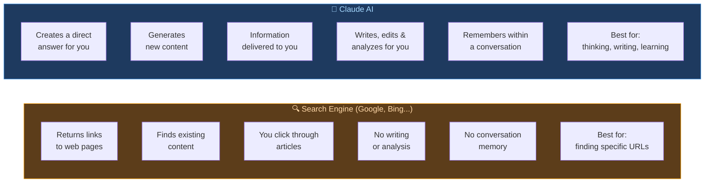

# 🤖 Day 1 — Introduction to Claude & AI

[Day 2 >>](../02_Day_Setup/02_day_setup.md)

---

## What You Will Learn Today

- What Artificial Intelligence (AI) is
- What Claude is and who made it
- Why Claude is different from a search engine
- What Claude can and cannot do
- Key vocabulary you'll use throughout this course

---

## What is Artificial Intelligence?

**Artificial Intelligence (AI)** is technology that allows computers to perform tasks that normally require human intelligence — like understanding language, answering questions, writing, solving problems, and reasoning.

Think of it this way:

| Traditional Software | AI |
|---------------------|-----|
| Follows exact, fixed rules | Learns patterns from data |
| Does exactly what it's programmed to do | Adapts based on context |
| Can't understand natural language | Understands and generates human language |
| Breaks when it encounters something unexpected | Handles new, unexpected inputs |

AI has been around for decades, but **Large Language Models (LLMs)** — the technology behind Claude — represent a major leap forward. They can hold conversations, write essays, explain complex topics, and help with an enormous range of tasks.

---

## What is Claude?

**Claude** is an AI assistant created by **Anthropic**, an AI safety company founded in 2021.

Claude is what's called a **Large Language Model (LLM)**. It was trained on vast amounts of text — books, websites, articles, code, and more — and learned to understand and generate human language.

> 💡 **Think of it like this:** Claude is like a highly knowledgeable assistant who has read millions of books and documents, and can discuss almost any topic, help you write, solve problems, or answer questions — all in a natural conversation.

### Key Facts About Claude

| Fact | Detail |
|------|--------|
| Created by | Anthropic |
| Type | Large Language Model (LLM) |
| Access | claude.ai (web), API, apps |
| Languages | Dozens of languages supported |
| Specialties | Writing, analysis, coding, reasoning, creativity |

---

## Claude vs. a Search Engine

Many beginners confuse Claude with a search engine like Google. They are very different:

| Google (Search Engine) | Claude (AI Assistant) |
|------------------------|----------------------|
| Finds existing web pages | Creates new responses |
| Returns links to information | Gives you the information directly |
| Doesn't understand your question deeply | Understands context and nuance |
| Can't write or create for you | Can write, explain, brainstorm, and analyze |
| Doesn't remember what you said before (in a session) | Remembers your conversation and builds on it |

**Example:**

If you ask Google "How do I write a professional email?", it gives you a list of articles to click through.

If you ask Claude "How do I write a professional email to my boss asking for a raise?", Claude writes the actual email for you — tailored to your situation.

---

## What Can Claude Do?

Claude is remarkably versatile. Here's a taste of what you'll learn to do in this course:

### ✅ Claude CAN help you with:

- **Writing** — emails, essays, reports, stories, cover letters
- **Research** — summarizing articles, explaining complex topics
- **Coding** — writing, debugging, and explaining code
- **Analysis** — reviewing documents, spotting issues
- **Brainstorming** — generating ideas, thinking through problems
- **Learning** — explaining anything in simple terms, tutoring
- **Translation** — converting text between languages
- **Creative work** — poems, scripts, character development
- **Productivity** — drafting plans, organizing information

### ❌ Claude CANNOT:

- Search the internet in real time (by default)
- Remember past conversations (each new chat starts fresh)
- Take actions in the real world (like sending emails or clicking buttons)
- Be 100% accurate — Claude can make mistakes, so always verify important facts
- Access your files unless you share them in the conversation

---

## Key Vocabulary

These terms will appear throughout the course. Get familiar with them now:

| Term | Meaning |
|------|---------|
| **AI** | Artificial Intelligence — computer systems that mimic human thinking |
| **LLM** | Large Language Model — the type of AI Claude is |
| **Prompt** | The message or question you send to Claude |
| **Response** | Claude's reply to your prompt |
| **Conversation / Chat** | A back-and-forth exchange with Claude |
| **Context** | The information Claude has access to in a conversation |
| **Token** | How Claude measures text (roughly 1 token ≈ ¾ of a word) |
| **Hallucination** | When AI generates incorrect information with confidence |
| **Anthropic** | The company that created Claude |

---

## Claude's Core Values

Anthropic designed Claude to be:

- **Helpful** — genuinely useful for a wide range of tasks
- **Harmless** — avoiding content that could cause harm
- **Honest** — acknowledging uncertainty, not making things up

This is why Claude sometimes says "I'm not sure" or "I could be wrong about this." That honesty is intentional and important.

---

## Summary

🌕 You made it through Day 1! Here's what you learned:

- **AI** is technology that mimics human intelligence
- **Claude** is an AI assistant made by Anthropic
- Claude is **not a search engine** — it creates, analyzes, and converses
- Claude is excellent at writing, research, coding, brainstorming, and more
- Claude has limits — it can make mistakes, doesn't browse the internet by default, and starts fresh each conversation
- Key terms: LLM, prompt, response, context, hallucination

Tomorrow you'll set up your Claude account and send your very first message!

---

## Exercises

### Level 1 — Beginner

1. In your own words, explain the difference between a search engine and Claude AI to a friend.
2. List 3 tasks in your daily life or work where you think Claude could help you.
3. What does "LLM" stand for, and what does it mean?

### Level 2 — Intermediate

4. Think about the last time you searched Google for something. How might the experience have been different if you had asked Claude instead?
5. What do you think "hallucination" means in the context of AI? Why might it happen?
6. Anthropic says Claude should be "helpful, harmless, and honest." Give one example of a situation where being honest might mean Claude says it doesn't know something.

### Level 3 — Challenge

7. Research (using any source): What makes Large Language Models different from earlier AI systems like rule-based chatbots?
8. Why do you think Anthropic focused on AI safety as a core part of building Claude? What risks might an AI assistant pose if it were not designed with safety in mind?
9. If you were building an AI assistant, what 3 values would you want it to have? Why?

---

🧡🧡🧡 HAPPY LEARNING 🧡🧡🧡

[Day 2 >>](../02_Day_Setup/02_day_setup.md)
