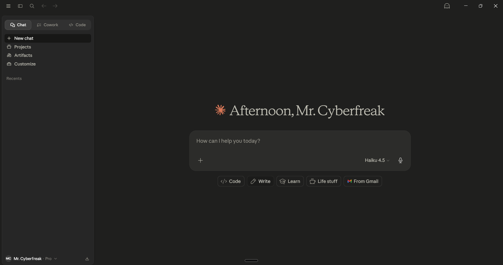

# 🤖 Day 2 — Setting Up: claude.ai, Apps & Access

[<< Day 1](../01_Day_Introduction/01_day_introduction.md) | [Day 3 >>](../03_Day_First_Conversation/03_day_first_conversation.md)

---

## 🎯 What You Will Learn Today

- How to create a free Claude account
- How to navigate the claude.ai interface
- The different ways to access Claude (web, mobile, API)
- Understanding the free vs. paid plans
- How to start a new conversation

---

## 🔐 Step 1: Create Your Claude Account

Getting started with Claude is free and only takes a few minutes.

### How to Sign Up

1. Go to **[claude.ai](https://claude.ai)**
2. Click **"Sign up"** or **"Get started for free"**
3. Choose to sign up with:
   - Google account
   - Email address
4. If using email, check your inbox for a verification link
5. Complete any verification steps
6. You now have access to Claude!

> ✅ **No credit card required** for the free plan.

---

## 🖥️ Step 2: Explore the Interface

Once you log in, you'll see the main Claude interface. Here's what each part does:

---

<div align="center">



</div>

---


```
┌─────────────────────────────────────────────────────────┐
│  ☰  Claude                                    [account] │
├──────────────┬──────────────────────────────────────────┤
│              │                                          │
│  New chat    │         Chat area                        │
│              │   (Claude's responses appear here)       │
│  Recent      │                                          │
│  chats       │                                          │
│              │                                          │
│              │                                          │
│              ├──────────────────────────────────────────┤
│              │  [  Type your message here...  ] [Send] │
└──────────────┴──────────────────────────────────────────┘
```

| Element | What It Does |
|---------|-------------|
| **New chat button** | Starts a fresh conversation |
| **Sidebar / Chat history** | Lists your previous conversations |
| **Chat area** | Where Claude's responses appear |
| **Message input box** | Where you type your prompts |
| **Send button** | Submits your message to Claude |

---

## 🌐 Ways to Access Claude

Claude is available in several places:

### 1. Web Browser (claude.ai)
- Works on any computer with a browser
- No installation needed
- Best for most beginners

### 2. Mobile Apps
- **iPhone/iPad:** Download "Claude" from the App Store
- **Android:** Download "Claude" from Google Play
- Great for quick questions on the go

### 3. Claude API (Advanced)
- For developers who want to build apps using Claude
- Requires programming knowledge
- Covered in Day 26 of this course

### 4. Third-Party Integrations
- Claude is available inside some other tools (like certain business apps)
- Depends on your workplace or tools

> 💡 **For this course, use claude.ai in a web browser.** It gives you the most complete experience.

> 📌 **Heads up:** While exploring online you may come across **"Claude Code"** (a developer tool) or **"Claude Cowork"** (a team workspace). These are separate products built on the same Claude AI — we'll map out the full picture on **Day 5**. For now, stick with claude.ai.

---

## 💰 Free vs. Paid Plans

Claude offers different plans. Here's a simple comparison:

| Feature | Free Plan | Pro Plan (Paid) |
|---------|-----------|-----------------|
| Access to Claude | ✅ Yes | ✅ Yes |
| Faster responses | Sometimes slower | Priority access |
| Advanced Claude models | Limited | Full access |
| Message limits | Yes, limited | Higher limits |
| Cost | Free | ~$20/month |

> 💡 **For this course, the free plan is enough to learn everything.** You only need Pro if you want to use Claude heavily for work.

---

## 💬 Step 3: Start a New Conversation

Let's walk through how a conversation works:

1. Click **"New chat"** in the sidebar
2. You'll see an empty chat screen with an input box at the bottom
3. Click in the input box and type a message
4. Press **Enter** (or click the send button)
5. Claude will respond — watch the text appear

Each conversation has its own memory. Claude remembers what you said **earlier in the same chat**, but **not across different chats**.

> ⚠️ **Important:** If you start a new chat, Claude forgets everything from the previous chat. This is by design — each conversation starts fresh.

---

## 💡 Tips for Using the Interface

- **Copy Claude's response:** Hover over the response and look for copy icons
- **Regenerate a response:** If you don't like Claude's answer, you can ask it to try again
- **Edit your message:** Some versions let you edit a sent message and get a new response
- **Rename a chat:** Click on the chat title in the sidebar to rename it for easy finding later
- **Delete a chat:** You can delete old conversations from the sidebar

---

## 📋 Summary

🌕 Day 2 complete! Here's what you set up:

- Created your **free Claude account** at claude.ai
- Learned to navigate the **interface** (sidebar, chat area, input box)
- Understood the **different ways to access Claude** (web, mobile, API)
- Learned the difference between **free and paid plans**
- Discovered how **conversation memory works** (within a chat, not across chats)

Tomorrow you'll have your first real conversation with Claude!

---

## 🏋️ Exercises

### 🟢 Level 1 — Beginner

1. Log in to claude.ai and start a new conversation. Type: "Hello! I'm new here. Can you introduce yourself?" — write down what Claude says.
2. What does the "New chat" button do, and why is it important?
3. Name two ways to access Claude other than the web browser.

### 🟡 Level 2 — Intermediate

4. Start two separate conversations with Claude. Ask the same question in both. Notice: are the answers slightly different? Why might that happen?
5. Try the Claude mobile app if you have a smartphone. How is the experience different from the web version?
6. If Claude doesn't remember previous conversations, what information do you need to provide each time you start a new chat? Why might this matter for complex tasks?

### 🔴 Level 3 — Challenge

7. Explore the claude.ai settings page (click your account icon). What options are available? Write a summary of what you find.
8. Why do you think AI companies offer free tiers? What's the business reason? What are the limitations of free plans for the user?
9. Imagine you work at a company and want to use Claude for your team. What factors would you consider when choosing between the free and paid plans?

---

🧡🧡🧡 HAPPY LEARNING 🧡🧡🧡

[<< Day 1](../01_Day_Introduction/01_day_introduction.md) | [Day 3 >>](../03_Day_First_Conversation/03_day_first_conversation.md)
