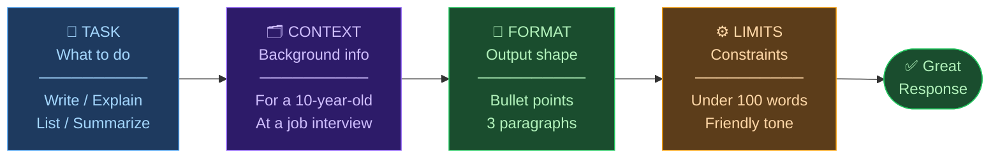

# 🤖 Day 3 — Your First Conversation

[<< Day 2](../02_Day_Setup/02_day_setup.md) | [Day 4 >>](../04_Day_Capabilities/04_day_capabilities.md)

---

## 🎯 What You Will Learn Today

- How to have a natural conversation with Claude
- The difference between a good and a vague prompt
- How Claude builds on context within a conversation
- Common beginner mistakes and how to avoid them
- How to guide Claude toward better answers

---

## 💬 How Conversations Work

Talking to Claude is like having a conversation with a knowledgeable friend. You say something, Claude responds, you reply, and it builds from there.

Here's a simple example:

```
You:    What is photosynthesis?

Claude: Photosynthesis is the process by which plants convert sunlight,
        water, and carbon dioxide into glucose (sugar) and oxygen.
        It happens in the chloroplasts of plant cells...

You:    Can you explain it like I'm 10 years old?

Claude: Sure! Imagine plants are like little kitchens. The sun is the
        stove, water and air are the ingredients, and the plant uses
        them to cook its own food (sugar). The "leftover" from cooking
        is oxygen — which we breathe!

You:    What would happen if there was no sunlight?

Claude: Without sunlight, plants can't make food. They'd slowly use up
        their stored energy and eventually die. This is why plants
        kept in the dark for too long wilt and turn yellow...
```

Notice how Claude remembers what was discussed earlier in the conversation. You don't have to explain photosynthesis again — Claude knows the context.

---

## ✍️ Your First Prompts

Open claude.ai and try these **starter prompts** right now:

### Prompt 1: Introduction
```
Hello! I've just started learning how to use Claude. 
Can you tell me a bit about yourself and what you can help me with?
```

### Prompt 2: Simple Question
```
What are three interesting facts about the ocean that most people don't know?
```

### Prompt 3: Help with a Task
```
I need to write a short email to my colleague thanking them for helping 
me on a project. Can you write one for me? Keep it professional but warm.
```

### Prompt 4: Follow-up
After receiving the email from Prompt 3, try:
```
Can you make it a bit more formal and add a line about looking forward to 
working together again?
```

---

## ⚖️ Good Prompts vs. Vague Prompts

The quality of Claude's response depends heavily on how you phrase your request. Compare these:

| Vague Prompt | Better Prompt |
|-------------|---------------|
| "Write something about dogs" | "Write a 3-sentence fun fact about Golden Retrievers for a children's website" |
| "Help me with my email" | "I need to politely decline a meeting invitation. Write a short, professional email" |
| "Explain programming" | "Explain what a 'variable' is in programming, using a simple everyday analogy" |
| "Give me advice" | "I'm starting a new job next week and I'm nervous. Give me 5 practical tips for making a good first impression" |

The pattern: **be specific** about what you want, who it's for, and what format you need.

> 💡 **The Golden Rule of Prompting:** The more clearly you describe what you want, the better Claude's response will be. Don't worry about being too specific — that's actually a good thing.

---

## 🔬 The Anatomy of a Great Prompt



A strong prompt often includes some of these elements:

```
[Task] + [Context] + [Format] + [Constraints]
```

**Example:**

```
Write [TASK] a product description [FORMAT] for a social media post [CONTEXT] 
for a new eco-friendly water bottle [CONSTRAINTS] in under 50 words, 
using an enthusiastic tone.
```

You don't need all four parts every time — but thinking about them helps.

| Element | What It Adds | Example |
|---------|-------------|---------|
| Task | What you want Claude to do | "Write", "Explain", "List", "Summarize" |
| Context | Background information | "for a 10-year-old", "for a job interview" |
| Format | How you want the output | "as bullet points", "in a table", "in 3 paragraphs" |
| Constraints | Limits or requirements | "under 100 words", "in a friendly tone" |

---

## 🎯 How to Guide Claude Mid-Conversation

If Claude's first response isn't quite right, don't start over — guide it:

| What's Wrong | What to Say |
|-------------|------------|
| Too long | "That's great, but can you make it shorter — around 3 sentences?" |
| Too technical | "Can you explain this more simply? I'm not an expert." |
| Wrong tone | "Can you rewrite this in a more casual/formal tone?" |
| Missing something | "This is good, but can you also include information about X?" |
| Completely off | "I think I wasn't clear. What I actually meant was..." |

Claude is very good at following correction. Think of it as working with a collaborator, not a vending machine.

---

## ⚠️ Common Beginner Mistakes

### Mistake 1: Being too vague
❌ "Tell me about history"
✅ "Summarize the main causes of World War I in 3 bullet points"

### Mistake 2: Asking too many things at once
❌ "Explain quantum physics, write me a poem, and give me a recipe for pasta"
✅ Ask one thing at a time

### Mistake 3: Not using follow-ups
Many beginners accept the first response and move on. Claude responds well to follow-up questions — use them!

### Mistake 4: Forgetting Claude doesn't know your life
Claude has no idea who you are. Give it relevant context:
❌ "Write an email for me"
✅ "Write an email from me (a marketing manager) to my client (a small business owner) about our upcoming campaign proposal"

### Mistake 5: Not verifying important information
Claude can be wrong — especially on specific facts, dates, or technical details. Always double-check important information from other sources.

---

## 💡 Conversation Tips

- **Be conversational** — you can talk to Claude like you'd talk to a helpful colleague
- **Be patient** — sometimes rephrasing helps Claude understand you better
- **Iterate** — the best results often come after a few rounds of back-and-forth
- **Experiment** — try different phrasings and see how the responses change
- **Ask "why"** — Claude can explain its own answers, which helps you learn

---

## 📋 Summary

🌕 Day 3 done! You had your first real conversations with Claude. Here's what you learned:

- Claude **builds context** within a conversation — you can reference earlier messages
- **Specific prompts** produce better responses than vague ones
- Use the **Task + Context + Format + Constraints** framework
- You can **guide Claude mid-conversation** if the response isn't right
- **Common mistakes:** vague prompts, asking too much at once, not verifying facts

---

## 🏋️ Exercises

### 🟢 Level 1 — Beginner

1. Send Claude this prompt: "I'm learning to use AI for the first time. What are 3 things I should know?" — Write down Claude's response in your own words.
2. Ask Claude to explain your favorite topic (sport, hobby, subject) as if explaining to a complete beginner. How did it do?
3. Send a vague prompt, then immediately send an improved, more specific version. Compare the two responses.

### 🟡 Level 2 — Intermediate

4. Have a 5-message conversation with Claude about a topic you want to learn. Practice: ask a question → follow up → ask for clarification → ask it to simplify → ask for an example.
5. Ask Claude to write something, then ask it to rewrite the same thing in 3 different tones (formal, casual, funny). Notice the differences.
6. Practice guiding Claude: ask it to write something, then give 2-3 rounds of feedback and corrections to improve it.

### 🔴 Level 3 — Challenge

7. Design a "perfect prompt" for a real task you need help with. Include all four elements: Task, Context, Format, and Constraints. Share what you got.
8. Test Claude's accuracy: ask it a question you already know the answer to. Did Claude get it right? If not, how did you correct it?
9. Have a multi-turn problem-solving conversation with Claude. Present a real problem you're facing (at work, school, or in life) and work through it together over at least 5 messages.

---

🧡🧡🧡 HAPPY LEARNING 🧡🧡🧡

[<< Day 2](../02_Day_Setup/02_day_setup.md) | [Day 4 >>](../04_Day_Capabilities/04_day_capabilities.md)
