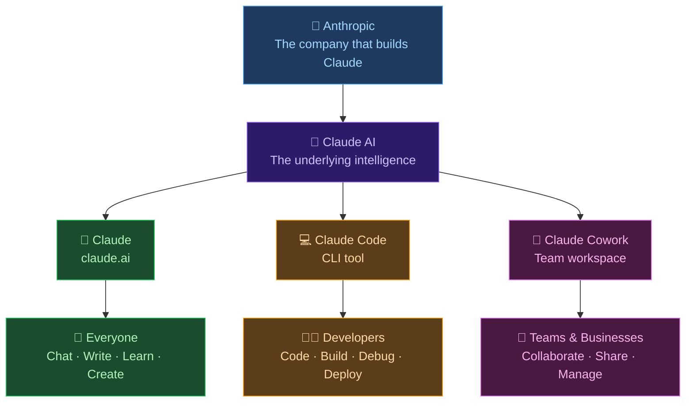

# 🤖 Day 5 — Claude Models & Plans

[<< Day 4](../04_Day_Capabilities/04_day_capabilities.md) | [Day 6 >>](../06_Day_Safety_And_Ethics/06_day_safety_and_ethics.md)

---

## 🎯 What You Will Learn Today

- What "models" are and why they matter
- Claude's different model versions (Haiku, Sonnet, Opus)
- The differences between free and paid plans
- How to choose the right model for your task
- What to expect from each tier of access
- The difference between Claude, Claude Code, and Claude Cowork

---

## 🧩 What is a "Model"?

When people talk about AI "models," they mean the specific version of the AI system being used. Think of it like different cars from the same manufacturer — a Toyota Corolla and a Toyota Land Cruiser are both Toyotas, but they have different capabilities, sizes, and price points.

Claude has multiple models designed for different use cases:

```
Claude Model Family
├── Claude Haiku     → Fast, lightweight, efficient
├── Claude Sonnet    → Balanced: smart + fast
└── Claude Opus      → Most capable, deepest reasoning
```

Each model represents a different **tradeoff** between speed, cost, and intelligence.

---

## 🏆 The Claude Model Lineup


### Claude Haiku 🐦 — Fast & Efficient

**Best for:** Quick tasks, simple questions, high-volume work

| Attribute | Detail |
|-----------|--------|
| Speed | ⚡ Very fast |
| Intelligence | Good for everyday tasks |
| Cost (API) | Lowest |
| Best use | Simple Q&A, quick summaries, drafts |

**Example use cases:**
- "What's the capital of France?"
- "Summarize this paragraph in one sentence"
- "Fix the typos in this text"

---

### Claude Sonnet 🎵 — The Smart Middle Ground

**Best for:** Most everyday tasks — writing, analysis, coding

| Attribute | Detail |
|-----------|--------|
| Speed | ⚡⚡ Fast |
| Intelligence | Strong across almost all tasks |
| Cost (API) | Mid-range |
| Best use | Writing, coding, research, most tasks |

**Example use cases:**
- Writing a professional email
- Debugging a piece of code
- Explaining a complex topic
- Analyzing a business proposal

> 💡 **For most users, Sonnet is the sweet spot.** It's fast, smart, and handles the vast majority of tasks excellently.

---

### Claude Opus 🎭 — The Deep Thinker

**Best for:** Complex reasoning, nuanced analysis, difficult problems

| Attribute | Detail |
|-----------|--------|
| Speed | Slower (thinks more carefully) |
| Intelligence | Highest, deepest reasoning |
| Cost (API) | Highest |
| Best use | Complex analysis, research, hard coding problems |

**Example use cases:**
- Analyzing a complex legal document
- Working through a multi-step research problem
- Solving difficult technical challenges
- Strategic business analysis requiring deep reasoning

---

## ⚖️ Comparing the Models

| Capability | Haiku | Sonnet | Opus |
|-----------|-------|--------|------|
| Speed | Fastest | Fast | Slower |
| Simple tasks | ✅ Excellent | ✅ Excellent | ✅ Excellent |
| Writing & editing | ✅ Good | ✅ Excellent | ✅ Excellent |
| Coding | ✅ Good | ✅ Excellent | ✅ Excellent |
| Complex reasoning | ⚠️ Limited | ✅ Good | ✅ Best |
| Nuanced analysis | ⚠️ Basic | ✅ Strong | ✅ Best |
| API cost | $ | $$ | $$$ |

---

## 💼 Claude Plans: Free vs. Pro vs. Team

### Free Plan
- Access to Claude (usually Haiku or Sonnet)
- Limited number of messages per day/hour
- May experience slower responses during peak times
- **Best for:** Learning, occasional use, trying Claude out

### Claude Pro (~$20/month)
- Access to all models including Opus
- Higher message limits
- Priority access during busy periods
- Faster responses
- **Best for:** Daily heavy users, professionals, students doing serious work

### Claude Team (Business)
- Higher usage limits
- Team management features
- Enterprise-grade security
- **Best for:** Businesses and teams

> 💡 **For this course, the free plan is sufficient.** You'll learn everything you need without needing to pay. Consider Pro only if you find yourself hitting limits or needing Claude for important daily work.

---

## 🌐 The Claude Ecosystem — Products vs. Models

So far you've learned about Claude's *models* (Haiku, Sonnet, Opus) and *plans* (Free, Pro, Team). But there's a third dimension that confuses many beginners: **Claude products**.

Anthropic builds one AI brain — Claude — but packages it into different **products** designed for different types of users. Think of it like Microsoft offering Word, Excel, and Teams: they all share the same Office engine, but each is built for a completely different job.



### The Three Claude Products at a Glance

| | 💬 Claude (claude.ai) | 💻 Claude Code | 👥 Claude Cowork |
|---|---|---|---|
| **What it is** | Chat assistant in your browser | AI coding tool in your terminal | Team collaboration workspace |
| **Who it's for** | Everyone | Software developers | Teams and businesses |
| **How you use it** | Web browser or mobile app | Command-line interface (CLI) | Shared team workspace |
| **Primary job** | Chat, write, analyze, learn | Write, debug, and build software | Manage shared AI workflows |
| **Tech skill needed** | None | Coding knowledge required | Some setup required |
| **This course uses** | ✅ Yes | ❌ No | ❌ No |

> 💡 **This course uses claude.ai only.** You never need to install Claude Code or set up Claude Cowork to complete any lesson here.

> ⚠️ **Common confusion:** Many beginners Google "Claude" and land on Claude Code documentation, which uses developer terms like "CLI", "terminal", and "API keys". If that's happened to you — you're in exactly the right place. This course is for the simple web interface at claude.ai, no coding required.

### Which Product Is Right for You?

Use this decision tree:

```
Are you a software developer who wants Claude inside your terminal or code editor?
├── YES → Claude Code is for you
└── NO  → Are you managing a team that needs shared AI access?
          ├── YES → Claude Cowork is for you
          └── NO  → Claude (claude.ai) is for you  ← YOU ARE HERE
```

### How Models Fit In

Here's how everything connects:

```
Claude Product  →  claude.ai
                   └── uses Claude Models  →  Haiku / Sonnet / Opus
                       └── available via  →  Free / Pro / Team Plans
```

The product is **what you open**. The model is **the brain running inside it**. The plan is **how much access you get**. All three layers exist for every product.

---

## 🔍 How to Know Which Model You're Using

On claude.ai, you may see the model name displayed near the chat input box or in settings. The available models depend on your plan.

- **Free plan:** Usually Claude Sonnet or Haiku
- **Pro plan:** Choose between Haiku, Sonnet, or Opus

When in doubt, check the claude.ai settings or the model selector if one is visible.

---

## 🎯 Choosing the Right Model for Your Task

Use this simple guide:

| Task Type | Recommended Model |
|-----------|------------------|
| Quick factual questions | Haiku |
| Writing emails and documents | Sonnet |
| Learning and explanations | Sonnet |
| Code writing and debugging | Sonnet or Opus |
| Complex research | Sonnet or Opus |
| Simple data extraction | Haiku |
| Deep analysis of documents | Opus |
| Creative writing | Sonnet |
| Strategic thinking | Opus |

---

## 🏷️ How Models Are Named

Model names follow a pattern:

```
Claude [Model] [Version]
Example: Claude Sonnet 4.6
```

- **Claude** = the product name
- **Sonnet** = the model tier
- **4.6** = the version number

Anthropic updates models over time. Newer versions within the same tier are generally better than older ones.

---

## 📋 Summary

🌕 Day 5 complete! Here's what you learned about Claude models:

- **Haiku** — fast, efficient, best for simple tasks
- **Sonnet** — smart and fast, best for most everyday tasks
- **Opus** — deepest reasoning, best for complex problems
- **Free plan** is enough to learn Claude; **Pro** unlocks more models and higher limits
- Match your task to the right model tier for best results
- **Claude ecosystem:** one AI brain, three products — claude.ai (everyone), Claude Code (developers), Claude Cowork (teams)

---

## 🏋️ Exercises

### 🟢 Level 1 — Beginner

1. Look at your current Claude interface. What model are you using? (Check the settings or model selector)
2. In your own words, explain the difference between Haiku, Sonnet, and Opus to a friend who has never heard of Claude.
3. For each of the following tasks, pick which model you would use and explain why: (a) checking grammar in an email, (b) analyzing a 20-page business report, (c) answering "what is 15% of 80?"

### 🟡 Level 2 — Intermediate

4. If you have access to multiple models, ask the same question to two different models and compare the responses. How are they different?
5. Why do you think AI companies offer multiple tiers of models instead of just one? What business and user reasons might explain this?
6. Research the latest Claude model versions available. How do they compare to what's described in this lesson? (AI moves fast — things may have changed!)

### 🔴 Level 3 — Challenge

7. Design a workflow for a specific job or task (e.g., a marketer writing weekly content, a student doing research). Which Claude model would you use for which parts of the workflow? Explain your reasoning.
8. AI companies continuously release new model versions. What factors do you think drive these improvements? What challenges do engineers face when building more capable models?
9. If you were advising a small business on whether to use the free or paid Claude plan, what questions would you ask them first? What criteria would you use to make your recommendation?

---

🧡🧡🧡 HAPPY LEARNING 🧡🧡🧡

[<< Day 4](../04_Day_Capabilities/04_day_capabilities.md) | [Day 6 >>](../06_Day_Safety_And_Ethics/06_day_safety_and_ethics.md)
