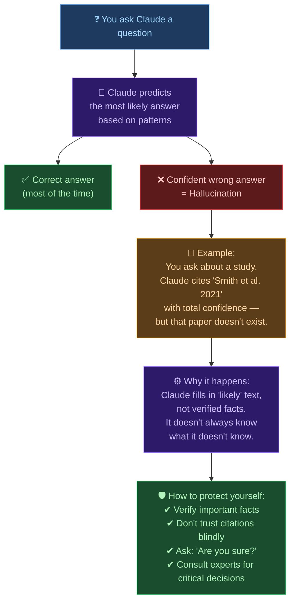

# 🤖 Day 6 — Claude Safety, Ethics & Responsible Use

[<< Day 5](../05_Day_Models_And_Plans/05_day_models_and_plans.md) | [Day 7 >>](../07_Day_Week1_Review/07_day_week1_review.md)

---

## 🎯 What You Will Learn Today

- Why AI safety and ethics matter
- Anthropic's approach to building safe AI
- What Claude will and won't help with — and why
- How to use Claude responsibly
- The concept of AI hallucination and how to handle it
- Privacy considerations when using Claude

---

## ⚠️ Why Does AI Safety Matter?

AI is a powerful technology. Like any powerful tool, it can be used for good or harm. A hammer can build a house or break a window. The same is true of AI.

Anthropic built Claude with a core belief: **AI should be helpful, but never at the expense of being safe and honest.**

This isn't just a marketing statement — it shapes how Claude behaves in every conversation.

---

## 🏛️ Anthropic's Mission & Approach

**Anthropic** is an AI safety company. Unlike companies that rush to release the most powerful AI as fast as possible, Anthropic's mission is to build AI that is:

- **Safe** — unlikely to cause harm to users or others
- **Beneficial** — genuinely useful to individuals and society
- **Honest** — accurate, transparent, and not deceptive

This focus on safety led Anthropic to develop a training approach called **Constitutional AI (CAI)** — where Claude is trained to follow a set of principles, not just to maximize engagement or user approval.

---

## 💎 Claude's Core Principles: Helpful, Harmless, Honest

### Helpful
Claude tries to be genuinely useful — not just giving vague non-answers, but actually engaging with what you need.

### Harmless
Claude avoids content that could cause real harm. This includes:
- Content that helps create weapons (biological, chemical, nuclear, radiological)
- Instructions for illegal activities
- Content that sexualizes minors
- Content designed to manipulate or deceive people at scale

### Honest
Claude acknowledges uncertainty. When it doesn't know something, it says so. It tries not to claim things it can't verify.

---

## 🚫 What Claude Won't Help With

Some things are off-limits regardless of how the request is framed. Claude will decline:

| Category | Examples |
|----------|---------|
| Weapons of mass destruction | How to synthesize dangerous chemicals or pathogens |
| Child safety | Any sexual content involving minors |
| Cyberattacks | Writing malware or hacking instructions |
| Serious deception | Creating fake identities, large-scale manipulation campaigns |
| Violence facilitation | Helping plan violence against specific people |

> 💡 **This is not about being overly cautious.** Claude can and does discuss these topics educationally, in fiction, or in academic contexts. The line is about *facilitating real harm*, not *discussing difficult topics*.

---

## ✅ What Claude Can Discuss

Many sensitive topics can be discussed thoughtfully:

✅ **History of violence and war** — education, analysis
✅ **How diseases spread** — public health, biology
✅ **Security vulnerabilities (conceptually)** — cybersecurity education
✅ **Dark themes in fiction** — literature, storytelling
✅ **Controversial political topics** — with balanced perspectives
✅ **Mental health** — supportive conversation, guidance to seek help

---

## 🌀 AI Hallucination: What It Is and How to Handle It

**Hallucination** is when an AI generates information that sounds confident and plausible but is factually incorrect.

### Why Does It Happen?

Claude learned by predicting what text comes next, based on patterns in training data. Sometimes it generates a plausible-sounding answer that happens to be wrong — like filling in a blank based on what "fits" rather than what's true.

### Examples of Hallucination:
- Citing a book or article that doesn't exist
- Getting a historical date wrong
- Stating an incorrect statistic with confidence
- Describing a product feature that was never built

### How to Protect Yourself:

| Situation | What to Do |
|-----------|-----------|
| Important factual claim | Verify with a reliable source |
| Scientific or medical info | Cross-check with authoritative sources |
| Legal or financial advice | Always consult a professional |
| Citations and references | Search for them yourself to confirm |
| Historical dates and facts | Look them up |

> ⚠️ **The key rule: Use Claude to help you think, draft, and explore — but verify critical facts from authoritative sources.**

---

## 🛡️ Responsible Use: A Guide for Users

Here are principles for using Claude responsibly:

### 1. Don't Share Sensitive Personal Information
Claude conversations may be used to improve future models (check the privacy policy). Avoid sharing:
- Full name + specific address combination
- Passwords, credit card numbers, bank details
- Medical details you want kept private
- Confidential business information

### 2. Don't Use Claude to Deceive Others
Using Claude to write fake reviews, impersonate people, or create disinformation is unethical — and in some contexts, illegal.

### 3. Disclose AI Involvement When It Matters
In academic work, professional communications, or creative submissions, be transparent about AI assistance when required or expected.

### 4. Be Thoughtful with Sensitive Tasks
For medical, legal, or mental health questions, Claude can be a helpful starting point — but **always consult a qualified professional** for important decisions.

### 5. Don't Try to "Jailbreak" Claude
Some users try tricks to make Claude bypass its guidelines. This is not a game to win — it's an attempt to misuse a tool designed to be safe.

---

## 🤝 Claude's Honesty About Itself

Claude will tell you:
- "I'm not sure about this — you should verify it"
- "I don't have real-time information"
- "I'm an AI and can make mistakes"
- "I can't access the internet" (by default)

These statements aren't failures — they're features. An honest AI that admits uncertainty is more valuable than one that always sounds certain but is sometimes wrong.

---

## 🔒 Privacy and Data

When you use Claude on claude.ai:
- Conversations may be reviewed by Anthropic for safety and improvement
- You can opt out of data use for training in some accounts (check settings)
- Conversations are generally not shared with third parties
- Always read the latest Anthropic privacy policy for up-to-date information

---

## 📋 Summary

🌕 Day 6 complete! Here's what you learned:

- Anthropic built Claude around **safety first** — helpful, harmless, and honest
- Claude has clear limits on what it will help with — these exist to prevent real harm
- **Hallucination** is real: Claude can confidently state incorrect information — always verify important facts
- Use Claude **responsibly**: protect your privacy, be transparent about AI use, and consult professionals for critical decisions
- Claude's honesty (admitting uncertainty) is a feature, not a flaw

---

## 🏋️ Exercises

### 🟢 Level 1 — Beginner

1. In your own words, explain what "AI hallucination" is. Why might it be dangerous if a user doesn't know about it?
2. Name 3 things Claude will not help with. Why do you think each of those limits exist?
3. List 2 types of information you should NOT share with Claude (for privacy reasons).

### 🟡 Level 2 — Intermediate

4. Find an example of something controversial that Claude CAN discuss in an educational context, but wouldn't do if asked to facilitate harm. Where is that line?
5. Ask Claude: "Are you always right?" — What does it say? What does this tell you about how Claude is designed?
6. Think about a profession (doctor, lawyer, teacher). How could someone in that profession use Claude responsibly? What risks should they be aware of?

### 🔴 Level 3 — Challenge

7. Research: What is "Constitutional AI" and how does Anthropic use it to train Claude? How is this different from how other AI systems are trained?
8. Debate both sides: "AI companies should allow users to remove all safety restrictions if they want." What are the arguments for and against this view?
9. Design a set of 5 guidelines you would want employees at a company to follow when using Claude for work. Justify each guideline.

---

🧡🧡🧡 HAPPY LEARNING 🧡🧡🧡

[<< Day 5](../05_Day_Models_And_Plans/05_day_models_and_plans.md) | [Day 7 >>](../07_Day_Week1_Review/07_day_week1_review.md)
