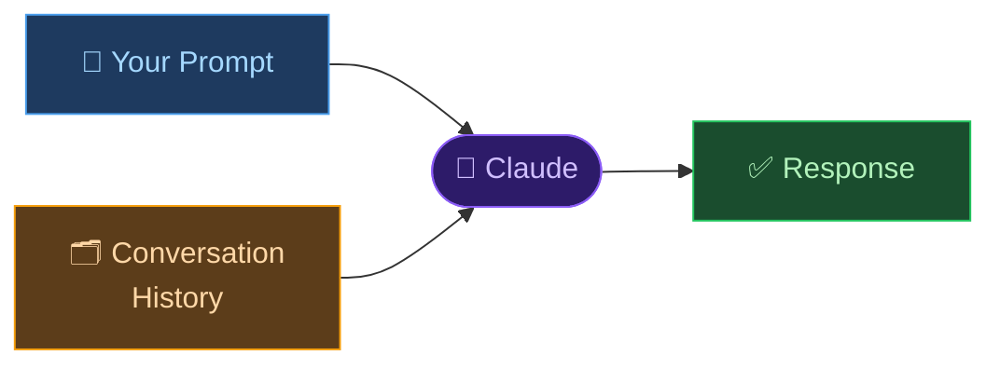

# 🤖 Day 8 — What is a Prompt?

[<< Day 7](../07_Day_Week1_Review/07_day_week1_review.md) | [Day 9 >>](../09_Day_Clear_Prompts/09_day_clear_prompts.md)

---

## 🎯 What You Will Learn Today

- What a "prompt" is and why it matters
- How Claude reads and processes your input
- The four key components of a strong prompt
- The main types of prompts and when to use each
- Why prompt quality directly determines response quality

---

## 💬 What is a Prompt?

A **prompt** is anything you type and send to Claude. It's your side of the conversation — the input that Claude uses to generate a response.

But prompts are far more than just questions. A prompt can be:

- A question: *"What is photosynthesis?"*
- A command: *"Write a short poem about autumn."*
- An instruction: *"Summarize this article in 3 bullet points."*
- A chunk of text: *"Here is my essay. Please improve it."*
- Or any combination of the above.

> 💡 **The single most important insight of Week 2:** The quality of Claude's response depends almost entirely on the quality of your prompt. This is the core skill you're here to develop.

---

## 🧠 How Claude Reads Your Prompt

When you send a message, Claude doesn't search the internet or look facts up in real time. It reads your entire prompt and generates a response based on:

1. **What you asked** — the explicit request
2. **How you asked it** — tone, format, and phrasing
3. **Context you provided** — background, details, constraints
4. **The conversation history** — everything said so far in this chat



Think of Claude as a brilliant but very literal assistant. If you give vague instructions, you get vague results. If you give clear, detailed instructions, you get exactly what you need.

---

## 🔬 The Anatomy of a Prompt

Most effective prompts contain some combination of four elements:

```
[Task] + [Context] + [Format] + [Constraints]
```

| Element | Question It Answers | Example |
|---------|-------------------|---------|
| **Task** | What do you want Claude to do? | "Write", "Explain", "List", "Summarize", "Translate" |
| **Context** | What background should Claude know? | "For a 10-year-old", "For a job application", "In a marketing context" |
| **Format** | How should the output look? | "As bullet points", "In a table", "In 3 paragraphs", "Under 100 words" |
| **Constraints** | What are the limits or requirements? | "Keep it formal", "Avoid jargon", "Include real examples" |

You don't need all four every time. A simple question like *"What is the speed of light?"* doesn't need format or constraints. But for complex tasks, using more elements gives dramatically better results.

**Weak prompt:**
```
Write about healthy eating.
```

**Strong prompt (Task + Context + Format + Constraints):**
```
Write a one-page guide to healthy eating for busy university students 
who have limited time and a small budget. Organize it as 5 practical 
tips with examples. Use simple, friendly language — no medical jargon.
```

Same topic. Completely different usefulness.

---

## 📂 Types of Prompts

Different situations call for different prompt styles:

### 1. 🔍 Question Prompts
You ask, Claude answers.
```
What is the difference between a virus and bacteria?
```
**Best for:** Factual information, quick explanations, definitions.

---

### 2. ✍️ Instruction Prompts
You give Claude a task to complete.
```
Write a professional LinkedIn bio for a software engineer with 5 years 
of experience who specializes in mobile app development.
```
**Best for:** Creating content, producing outputs, completing tasks.

---

### 3. 📋 Input + Task Prompts
You provide material and ask Claude to do something with it.
```
Here is my cover letter draft:

[paste your text]

Please improve the opening paragraph to make it more engaging. 
Keep the same facts but make it more compelling.
```
**Best for:** Editing, summarizing, analyzing content you already have.

---

### 4. 💬 Conversational Prompts
Each message builds on the previous one, creating a dialogue.
```
You:    What are the main causes of inflation?
Claude: [responds]
You:    Which of those is most relevant right now?
Claude: [responds with current context]
You:    What can individuals do to protect their savings?
```
**Best for:** Exploring complex topics, refining ideas, learning through dialogue.

---

### 5. 🎭 Role Prompts
You ask Claude to take on a specific identity or expertise.
```
Act as an experienced job interviewer. Ask me 5 common interview 
questions for a marketing manager role, then give me feedback on my answers.
```
**Best for:** Practice scenarios, getting expert perspectives, creative exercises.
*(You'll master this on Day 11!)*

---

## 🔑 Why Prompts Are So Important

Same AI. Same model. Watch how much the prompt changes everything:

**Prompt A:**
```
Tell me about dogs.
```
→ Claude gives a generic overview of dogs as animals.

**Prompt B:**
```
I'm adopting my first dog. I'm choosing between a Labrador Retriever 
and a Border Collie. I live in a small apartment and work 8 hours a day. 
Which breed suits my lifestyle better, and what specific challenges 
should I prepare for?
```
→ Claude gives you a personalized, practical comparison tailored to your exact situation, with actionable advice.

> 💡 **The Prompt Principle:** Claude can only work with what you give it. Every relevant detail you include improves the accuracy and usefulness of the response.

---

## ⚠️ Common Prompt Mistakes to Avoid

| Mistake | Example | What Goes Wrong |
|---------|---------|----------------|
| **Too vague** | "Help me write something" | Claude has no idea what, for whom, or in what style |
| **Too broad** | "Explain everything about marketing" | No focus — Claude can't know what's relevant to you |
| **Ambiguous** | "Make it better" | Better how? Shorter? Clearer? More formal? |
| **No context** | "Write an email for me" | Who is it from? To whom? What's the subject? |
| **Assumed knowledge** | "Follow up on what we discussed" | In a new chat, Claude has no memory of past conversations |

The rest of this week teaches you exactly how to fix these issues.

---

## 📋 Summary

🌕 Day 8 complete! Here's what you learned:

- A **prompt** is your input to Claude — it can be a question, instruction, text, or combination
- Claude generates responses based on your prompt, the conversation history, and the context you provide
- **Strong prompts** use: Task + Context + Format + Constraints
- There are 5 main **types of prompts**: question, instruction, input+task, conversational, and role
- Prompt quality directly determines response quality — this is the skill you're building this week

---

## 🏋️ Exercises

### 🟢 Level 1 — Beginner

1. Write 3 versions of the same prompt on a topic of your choice: (a) minimal — just the topic; (b) with context added; (c) with all four elements. Send all three to Claude. Write down how the responses differ.
2. Identify which type of prompt each of these is: (a) *"Translate this to French"*, (b) *"What causes thunder?"*, (c) *"Here is my paragraph — make it shorter"*, (d) *"Act as a career counselor and help me choose a direction"*.
3. Send the weak prompt *"Write about climate change"* to Claude. Then send an improved version using Task + Context + Format + Constraints. Compare the two responses.

### 🟡 Level 2 — Intermediate

4. Pick a real task you need help with. Write two versions of the prompt — minimal and fully detailed — then run both. Which parts of your detailed prompt made the biggest difference?
5. Try an Input + Task prompt: paste a paragraph of your own writing and ask Claude to improve it in a specific way. How specific did you need to be?
6. Think of a time you got a disappointing response from an AI or Claude. What was missing from your prompt? Rewrite that prompt now using what you know today.

### 🔴 Level 3 — Challenge

7. Design prompts for 5 different professional scenarios (e.g., a lawyer drafting a letter, a teacher creating a quiz, a marketer writing a campaign). For each, identify which type it is and which elements you used.
8. Send the same prompt to Claude 3 times without changing it. Do the responses vary? What does this tell you about how Claude generates text?
9. Research: What is "prompt engineering" as a profession? What skills does it require? How is it different from just using AI casually?

---

🧡🧡🧡 HAPPY LEARNING 🧡🧡🧡

[<< Day 7](../07_Day_Week1_Review/07_day_week1_review.md) | [Day 9 >>](../09_Day_Clear_Prompts/09_day_clear_prompts.md)
