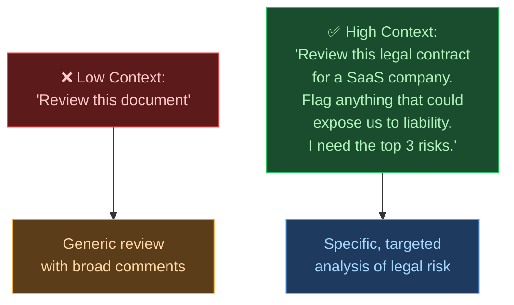

# 🤖 Day 10 — Using Context & Instructions

[<< Day 9](../09_Day_Clear_Prompts/09_day_clear_prompts.md) | [Day 11 >>](../11_Day_Role_Prompting/11_day_role_prompting.md)

---

## 🎯 What You Will Learn Today

- Why context is the most powerful tool in prompting
- The four types of context you can give Claude
- How to write clear, multi-part instructions
- How to set persistent rules for an entire conversation
- Techniques for keeping Claude on track across long chats

---

## 🌍 Why Context Changes Everything

Imagine you're asking a colleague for help. The same question — "Can you review this?" — means something completely different depending on whether you:

- Just joined the company or have been there 10 years
- Are reviewing a legal contract or a marketing email
- Need a response in 5 minutes or have a week
- Want brutal honesty or gentle encouragement

**Claude works the same way.** The more relevant context you provide, the more precisely Claude can tailor its response to what you actually need.



---

## 📦 The Four Types of Context

### 1. 🏠 Background Context
Information about the situation, project, or broader environment.

```
I'm preparing for a job interview at a fintech startup. 
The role is Senior Product Manager. The company builds B2B 
payment processing software. I have 4 years of product experience 
but this would be my first fintech role.

With this in mind, help me answer the question: 
"Why do you want to work in fintech?"
```

---

### 2. 👤 Audience Context
Who will read, hear, or use the output Claude creates?

```
Explain how a mortgage works. 
The audience is a group of recent university graduates at a financial 
literacy workshop — smart, but with no experience of property or finance.
```

Without this, Claude might explain mortgages at a level that's too technical, too simple, or too general.

---

### 3. 🎯 Purpose Context
What is this output going to be used for? What's the goal?

```
Write a short bio about me for LinkedIn.
Purpose: I'm open to new job opportunities and want to attract 
recruiters in the data science field.

[your name, experience, and skills]
```

vs.

```
Write a short bio about me for a conference speaker page.
Purpose: Establish credibility and get attendees excited for my talk 
on sustainable architecture.

[your name, experience, and background]
```

Same information. Completely different tone and emphasis depending on purpose.

---

### 4. ⚙️ Constraint Context
Rules Claude must follow throughout the response.

```
Answer the following question, but:
- Keep your answer under 150 words
- Use plain English — no technical jargon
- Give one concrete example
- Do not mention specific brands or products

Question: How does targeted advertising work?
```

---

## 📝 Writing Multi-Part Instructions

When your task has several components, structure your prompt clearly. Numbered lists work well:

```
Please do the following:

1. Summarize the key argument of this article in 2 sentences.
2. List 3 strengths of the argument.
3. List 2 weaknesses or gaps you notice.
4. Give this article a credibility rating of 1–10 with a one-sentence 
   justification.

[paste article here]
```

This is far more effective than:

```
Can you summarize this article and tell me what you think about it 
and whether it's good or not?
```

> 💡 **Tip:** Number your instructions when you have 3 or more steps. Claude will follow them in order and ensure each one is addressed.

---

## 🔄 Setting Instructions for the Whole Conversation

You can open a conversation by giving Claude a set of rules to follow throughout. This is especially useful for long working sessions.

**Example — setting up a writing session:**
```
For this entire conversation, follow these rules:
- You are helping me improve a children's book I'm writing
- The target age is 6–8 years old
- All language must be simple, warm, and encouraging
- When I paste text, give me specific suggestions, not rewrites
- Keep all feedback under 3 bullet points

Ready? I'll paste the first chapter now.
```

Claude will stick to these rules for the rest of the conversation unless you explicitly change them.

---

## 🗺️ How Context Accumulates in a Conversation

Claude remembers everything within a single conversation. This means you can build context gradually — you don't have to put everything in the first message.

**Example — building context across messages:**

```
Message 1:
"I'm writing a mystery novel set in 1920s London. The main character 
is a retired detective named Arthur Hale, 58 years old, cynical but 
principled."

Message 2:
"Arthur has just been hired by a wealthy widow to find out what 
happened to her missing husband."

Message 3:
"Write the opening paragraph of Chapter 1, starting with Arthur 
arriving at the widow's mansion in the rain."
```

By message 3, Claude has a rich picture of the setting, character, and tone. Your third prompt is short — but Claude has everything it needs.

---

## ⚠️ When Context Goes Wrong

| Problem | What Happens | Fix |
|---------|-------------|-----|
| **Too little context** | Claude makes assumptions that don't fit your situation | Add background, audience, and purpose |
| **Too much irrelevant context** | Claude gets confused about what's important | Only include context that affects the output |
| **Contradictory instructions** | Claude has to guess which rule to follow | Review your prompt for conflicts before sending |
| **Assuming Claude knows you** | Claude has no memory of past conversations | Re-establish context at the start of each new chat |

---

## 🧪 Try This: Context Experiment

Send these two prompts and compare the responses:

**Prompt A (no context):**
```
Give me advice about sleep.
```

**Prompt B (rich context):**
```
I'm a 28-year-old software engineer who works remotely. I've been 
struggling to sleep for 3 months — I lie awake for 1–2 hours every 
night despite feeling tired. I don't drink coffee after 2pm and I 
exercise 3 times a week. I've tried melatonin but it didn't help.

Please give me 5 practical, evidence-based suggestions that I haven't 
likely already tried. Focus on behavioral and environmental changes, 
not supplements.
```

The second prompt will produce advice that's dramatically more relevant and actionable.

---

## 📋 Summary

🌕 Day 10 complete! Here's what you learned:

- **Context** is the most powerful lever in prompting — it tells Claude who, what, why, and how
- The **four types of context**: background, audience, purpose, and constraints
- Use **numbered multi-part instructions** for complex tasks
- **Set persistent rules** at the start of a conversation for long working sessions
- Context **accumulates** across a conversation — you can build it gradually
- Only include **relevant** context — irrelevant details can dilute your prompt

---

## 🏋️ Exercises

### 🟢 Level 1 — Beginner

1. Take a simple request you have for Claude — anything at all. Write it without context, then rewrite it adding all four types of context (background, audience, purpose, constraints). Compare the responses.
2. Send Claude a multi-part instruction with 4 numbered steps asking it to do different things with a paragraph you've written. Verify that it completed each step.
3. Start a conversation by giving Claude 4–5 rules to follow throughout. Then work on a task for 5+ messages. Does Claude stick to the rules?

### 🟡 Level 2 — Intermediate

4. Write a prompt for a professional task (report, email, analysis) using only your job title as context. Then rewrite it adding full background, audience, and purpose context. How much does the quality improve?
5. Intentionally write a prompt with contradictory instructions (e.g., "be brief but comprehensive"). What does Claude do? Then fix the contradiction and resend.
6. Have a 6-message conversation where you deliberately build context across messages, adding a new layer of detail in each one. By message 6, ask Claude to produce a final output. How does the result compare to asking for the same output at the start with no context?

### 🔴 Level 3 — Challenge

7. Design a "conversation template" for a recurring work session (e.g., weekly meeting prep, content drafting, code review). Write the opening context-setting message you would send at the start of every session.
8. Find an example of a very long, complex task (e.g., writing a business plan, designing a curriculum). Break it into a sequence of context-building messages. Write out all 5–6 messages in order.
9. Research: What is a "system prompt" in AI? How do companies use system prompts to give Claude persistent context? *(Hint: this is covered in depth on Day 25!)*

---

🧡🧡🧡 HAPPY LEARNING 🧡🧡🧡

[<< Day 9](../09_Day_Clear_Prompts/09_day_clear_prompts.md) | [Day 11 >>](../11_Day_Role_Prompting/11_day_role_prompting.md)
