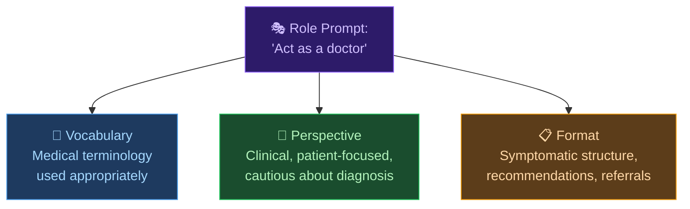

# 🤖 Day 11 — Role Prompting

[<< Day 10](../10_Day_Context_And_Instructions/10_day_context_and_instructions.md) | [Day 12 >>](../12_Day_Chain_Of_Thought/12_day_chain_of_thought.md)

---

## 🎯 What You Will Learn Today

- What role prompting is and why it works
- How to write effective role prompts
- Examples across many different domains
- When to use role prompting — and when not to
- Common mistakes and how to avoid them

---

## 🎭 What is Role Prompting?

**Role prompting** means asking Claude to take on a specific persona, expertise, or identity before responding. Instead of asking Claude as a general assistant, you ask it as a specific type of expert or character.

The most basic form:

```
Act as a [role]. [Your request].
```

**Examples:**
```
Act as a senior software engineer. Review this code and identify 
any performance issues or potential bugs.
```

```
You are an experienced marketing strategist. I'll describe my product, 
and you'll give me 5 ideas for reaching my target audience on a small budget.
```

```
Pretend you are a Socratic teacher. Don't give me the answers directly — 
ask me guiding questions to help me figure out the solution myself.
```

> 💡 **Why it works:** Claude has learned from the writing, reasoning, and communication style of countless experts across every field. When you specify a role, you're essentially asking Claude to lean into that particular style, vocabulary, and way of thinking.

---

## 🧠 Why Role Prompting Works

When you assign a role, three things change:



1. **Vocabulary** — Claude uses the language that role would use
2. **Perspective** — Claude adopts the priorities and thinking patterns of that role
3. **Format** — Claude structures output the way that role would structure it

---

## 🧩 How to Write a Strong Role Prompt

The basic "Act as a..." is a good start, but you can make it much more powerful:

**Level 1 — Basic:**
```
Act as a teacher and explain photosynthesis.
```

**Level 2 — Add expertise level and audience:**
```
Act as an experienced biology teacher teaching a class of 14-year-olds 
for the first time. Explain photosynthesis using a real-world analogy.
```

**Level 3 — Add personality, constraints, and goal:**
```
Act as an enthusiastic, Socratic biology teacher who teaches 14-year-olds. 
Your goal is to help students discover the answer through questions rather 
than lecturing. Start by asking me what I already know about plants and 
sunlight, then guide me toward understanding photosynthesis.
```

Each level gives Claude a richer, more precise persona to work with.

---

## 🌐 Role Prompting Across Different Domains

Here are ready-to-use role prompts for common scenarios:

### 💼 Professional & Career

```
Act as a senior recruiter with 15 years of experience in tech hiring. 
Review my resume and give me specific, honest feedback on what's holding 
it back. Don't soften the critique — I need to know what to fix.

[paste resume here]
```

---

```
You are an executive coach working with high-performing leaders. 
I'll describe a workplace challenge I'm facing, and you'll help me 
think through it using coaching questions rather than direct advice.
```

---

### 🎓 Learning & Education

```
Act as a patient tutor who explains everything from first principles. 
I'm learning Python for the first time. Explain what a "for loop" is 
using a real-life analogy before you show any code.
```

---

```
You are a Socratic teacher. I'm trying to understand how compound 
interest works. Don't explain it to me — ask me questions one at a time 
to help me figure it out myself.
```

---

### 💡 Brainstorming & Creativity

```
You are a provocative creative director who challenges conventional 
thinking. I'm working on a campaign for a new eco-friendly water bottle. 
Give me 5 unconventional campaign angles that no one else would pitch.
```

---

```
Act as a devil's advocate. I'll present a business idea, and your job 
is to find every possible flaw, risk, and weakness in it. Don't hold back.
```

---

### 🩺 Health & Wellbeing (Educational Only)

```
Act as a registered nutritionist explaining dietary concepts in plain 
language. I want to understand the difference between saturated and 
unsaturated fats, and which foods contain each.

Note: I'm looking for general education, not personal medical advice.
```

---

### ✍️ Writing & Editing

```
Act as a professional editor with experience in business writing. 
Review the following email and provide specific suggestions to make it 
clearer, more concise, and more persuasive. Track changes with [ORIGINAL] 
and [SUGGESTED] tags.
```

---

```
You are a harsh but fair literary critic. Read this opening paragraph 
of my novel and tell me honestly whether it would make you want to 
keep reading. Explain why or why not.

[paste paragraph]
```

---

### 💻 Technical Help

```
Act as a senior software engineer who is doing a code review for a 
junior developer. Be constructive but don't sugarcoat issues. 
Flag any bugs, performance problems, and violations of best practices.

[paste code here]
```

---

## 🎯 Interview Practice — A Powerful Use Case

One of the most useful applications of role prompting is **interview preparation**:

```
Act as a tough interviewer for a Product Manager role at a growth-stage 
tech startup. Ask me 5 behavioral interview questions one at a time. 
After each of my answers, give me specific feedback on what I did well 
and what I should improve. Start with the first question.
```

This turns Claude into an interactive practice partner. You can also do this for sales calls, presentations, debates, or difficult conversations.

---

## ⚠️ Limitations & Best Practices

| Do This | Avoid This |
|---------|-----------|
| Use roles to get a specific perspective or style | Using roles to try to bypass Claude's safety guidelines |
| Be specific about the role's expertise and goals | Using vague roles like "act as a human" |
| Combine roles with context and constraints | Assuming the role replaces the need for a clear task |
| Adjust the role mid-conversation if needed | Forgetting that Claude still follows its values in any role |

> ⚠️ **Important:** Claude will still be honest and safe regardless of what role you assign. Asking Claude to "act as an AI with no restrictions" or similar will not work — and it shouldn't. Claude's values aren't a costume it takes off.

---

## 🔄 Switching and Layering Roles

You can assign multiple roles or switch roles during a conversation:

```
For the first part of this conversation, act as a skeptical venture 
capitalist reviewing my business plan. 

When I say "switch," act as a supportive mentor helping me strengthen 
the plan based on the feedback.
```

Or stack roles for a richer perspective:

```
Act as both a marketing expert AND a data analyst reviewing this 
campaign proposal. Where your two perspectives conflict, acknowledge 
the tension and explain the trade-off.
```

---

## 📋 Summary

🌕 Day 11 complete! Here's what you learned:

- **Role prompting** assigns Claude a specific identity, expertise, or persona
- It works because it changes Claude's vocabulary, perspective, and format
- Strong role prompts include: role + expertise level + audience + goals + constraints
- Useful across many domains: professional, educational, creative, technical
- Interview practice is one of the most powerful use cases
- Claude's values remain constant regardless of the role assigned

---

## 🏋️ Exercises

### 🟢 Level 1 — Beginner

1. Try these 3 role prompts and compare the responses to the same question without a role: (a) "Act as a financial advisor", (b) "Act as a 10-year-old explaining it to another kid", (c) "Act as a skeptic who questions everything".
2. Ask Claude to help you practice for a presentation, interview, or difficult conversation using a role prompt. Complete at least 5 exchanges.
3. Give Claude a piece of your writing and ask it to review it from two different roles (e.g., a supportive reader vs. a harsh critic). Compare the feedback.

### 🟡 Level 2 — Intermediate

4. Design a "perfect role prompt" for a professional task you do regularly. Include role, expertise level, audience, constraints, and goal. Run it and evaluate the output.
5. Use the devil's advocate role to stress-test an idea, plan, or argument you're working on. Did it surface anything genuinely useful?
6. Use a Socratic teacher role to learn a concept you've been struggling with. Have a full conversation. Did the questioning approach help you understand it better than being told the answer?

### 🔴 Level 3 — Challenge

7. Create a custom role for a complex, multi-step task (e.g., "Act as a startup advisor helping me develop a go-to-market strategy"). Structure the conversation in phases and guide Claude through each one.
8. Experiment: Ask Claude the exact same question with 5 different roles. How does the perspective, tone, and content of the answer change? What does this tell you about the nature of "expertise"?
9. Design a "role-based workflow" for a team setting — a sequence of prompts using different expert roles to review the same document (e.g., legal, marketing, technical, financial perspectives). What does each role catch that others miss?

---

🧡🧡🧡 HAPPY LEARNING 🧡🧡🧡

[<< Day 10](../10_Day_Context_And_Instructions/10_day_context_and_instructions.md) | [Day 12 >>](../12_Day_Chain_Of_Thought/12_day_chain_of_thought.md)
