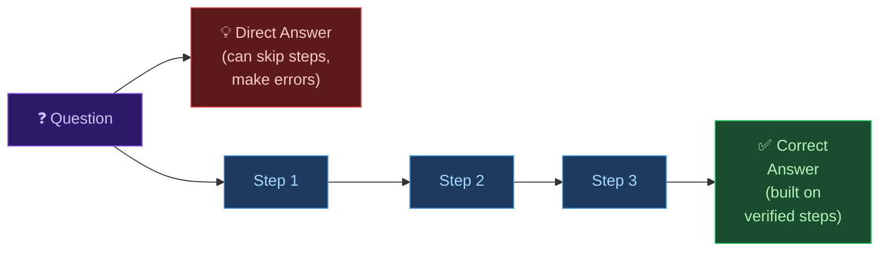

# 🤖 Day 12 — Chain of Thought Prompting

[<< Day 11](../11_Day_Role_Prompting/11_day_role_prompting.md) | [Day 13 >>](../13_Day_Few_Shot_Prompting/13_day_few_shot_prompting.md)

---

## 🎯 What You Will Learn Today

- What Chain of Thought (CoT) prompting is
- Why asking Claude to "think step by step" dramatically improves accuracy
- How to apply CoT to different types of problems
- When CoT helps the most — and when it's not needed
- How to combine CoT with other prompting techniques

---

## 🧩 What is Chain of Thought Prompting?

**Chain of Thought (CoT) prompting** is a technique where you ask Claude to show its reasoning process — to think through a problem step by step before giving the final answer.

Instead of asking for the answer directly, you ask Claude to **walk you through its thinking**.

```
❌ Standard prompt:
"If I have 3 boxes with 12 apples each, and I give away 15 apples, 
how many do I have left?"

✅ Chain of Thought prompt:
"If I have 3 boxes with 12 apples each, and I give away 15 apples, 
how many do I have left? Think through this step by step."
```

The second version asks Claude to reason aloud before concluding.

---

## 🧠 Why CoT Works

When Claude (or any LLM) generates text, it predicts one word at a time based on everything that came before. By asking it to reason step by step, you allow each step to become context for the next — creating a chain of logic rather than a leap to an answer.



Think of it like showing your work in a maths exam. When you write out each step, you're less likely to make errors — and if you do, it's easier to catch them.

---

## 🔑 How to Trigger Chain of Thought

You can ask Claude to reason step by step using many different phrases:

| Phrase | When to Use |
|--------|------------|
| `Think step by step.` | General reasoning tasks |
| `Let's work through this carefully.` | Multi-step problems |
| `Show your reasoning before giving the answer.` | When you want to check the logic |
| `Break this down into steps.` | Complex decisions or processes |
| `Explain each step of your thinking.` | Learning and understanding |
| `Before answering, consider each factor.` | Analysis and evaluation |
| `What are the intermediate steps?` | Process or workflow problems |

---

## 🧮 CoT for Mathematical & Logical Problems

This is where CoT provides the most dramatic improvement. Without it, Claude might jump to an answer and get it wrong.

**Without CoT:**
```
A train travels at 80km/h for 2.5 hours, then at 60km/h for 1.5 hours. 
What is the total distance?
```
→ Claude might calculate quickly and make arithmetic errors.

**With CoT:**
```
A train travels at 80km/h for 2.5 hours, then at 60km/h for 1.5 hours. 
What is the total distance? Think step by step.
```

Claude's response will now look like:

```
Step 1: Calculate distance for the first part of the journey.
Distance = Speed × Time = 80 km/h × 2.5 hours = 200 km

Step 2: Calculate distance for the second part of the journey.
Distance = Speed × Time = 60 km/h × 1.5 hours = 90 km

Step 3: Add both distances.
Total distance = 200 km + 90 km = 290 km

The total distance traveled is 290 km.
```

Each step is verifiable. If Claude made an error, you can spot exactly where.

---

## 🏛️ CoT for Complex Reasoning & Analysis

Chain of Thought isn't just for maths — it's powerful for any task requiring structured reasoning.

**Decision making:**
```
I've been offered two job offers:
- Offer A: £60,000 salary, startup, fully remote, no bonus, 
  high equity, uncertain future
- Offer B: £50,000 salary, established company, hybrid working, 
  10% annual bonus, good benefits, stable

Think step by step about the key factors I should weigh when making 
this decision. Then give me a recommendation.
```

**Argument analysis:**
```
Here is an argument: "Social media is making young people less happy 
because screen time reduces face-to-face interaction."

Think step by step: What are the premises? What evidence would we need 
to evaluate them? What are the weaknesses in this argument? 
Then give your overall assessment.
```

**Planning:**
```
I need to organize a team offsite for 20 people for one day. 
Budget is £2,000. Think through the key things to plan for, 
step by step, then give me a complete checklist.
```

---

## 📚 CoT for Learning & Explanation

When you're trying to understand something, asking Claude to reason step by step can make explanations far easier to follow.

```
Explain how a car engine works. Break your explanation into clear 
steps, starting from fuel entering the engine to the wheels turning.
```

```
I don't understand compound interest. Walk me through a concrete 
example step by step, starting from first principles. 
Use £1,000 invested at 5% annual interest.
```

---

## 🔬 Zero-Shot vs. Prompted CoT

You can trigger chain of thought in two ways:

| Method | What It Looks Like |
|--------|-------------------|
| **Prompted CoT** | You explicitly ask Claude to think step by step |
| **Natural CoT** | Claude reasons step by step without being asked (for complex questions, it often does this automatically) |

For important or complex tasks, always use **prompted CoT** — don't rely on Claude doing it automatically.

---

## 🤝 Combining CoT with Other Techniques

Chain of Thought works well alongside techniques from earlier this week:

**CoT + Role Prompting:**
```
Act as a financial advisor. A client wants to know whether to pay off 
their mortgage early or invest the extra money. Think through both 
options step by step, considering tax implications, interest rates, 
and risk, then give a recommendation.
```

**CoT + Context:**
```
I'm a freelance designer deciding whether to raise my rates. 
My current rate is £50/hour, I'm fully booked, and my clients 
are mostly small businesses. Think through this decision step by step, 
then give me a clear recommendation.
```

**CoT + Constraints:**
```
Think step by step about the pros and cons of remote work. 
Focus only on productivity and mental health — ignore commuting 
and environmental factors. Keep each step to 1–2 sentences.
```

---

## ⏱️ When to Use (and Not Use) CoT

| Use CoT When | Skip CoT When |
|-------------|--------------|
| The problem involves multiple steps | The answer is a simple fact |
| Math or logic is involved | You need a quick creative output |
| You want to verify Claude's reasoning | The task is conversational and casual |
| Making an important decision | You need a short, punchy answer |
| Learning a complex concept | The steps would be longer than the output |
| Analyzing an argument | Speed matters and accuracy is secondary |

---

## 📋 Summary

🌕 Day 12 complete! Here's what you learned:

- **Chain of Thought (CoT)** prompting asks Claude to reason step by step before answering
- It works because each reasoning step becomes context for the next — reducing errors
- Trigger it with phrases like *"think step by step"*, *"show your reasoning"*, *"break this down"*
- CoT is most powerful for: maths, logic, decisions, analysis, and learning
- Combine it with role prompting and context for even stronger results
- Use prompted CoT for anything important — don't rely on Claude to do it automatically

---

## 🏋️ Exercises

### 🟢 Level 1 — Beginner

1. Send the same maths or logic problem to Claude twice — once without CoT, once with *"think step by step"*. Compare the accuracy and clarity of both answers.
2. Use CoT to help Claude explain a concept you find confusing. Ask it to walk through the explanation step by step. Does this approach help you understand better?
3. Ask Claude to help you make a small decision (which coffee to order, which movie to watch). Ask it to think through the factors step by step. Is the recommendation better than a direct answer?

### 🟡 Level 2 — Intermediate

4. Give Claude a complex problem at work or in your personal life. Use CoT to get a structured analysis. Evaluate: did Claude surface factors you hadn't considered?
5. Take an argument you've read online (a news article, opinion piece, or debate). Ask Claude to analyze it step by step using the structure: premises → evidence needed → weaknesses → overall assessment.
6. Use CoT combined with a role prompt for a professional scenario. How does the combination change the quality of the reasoning compared to role prompting alone?

### 🔴 Level 3 — Challenge

7. Design a multi-step problem-solving session with Claude on a real challenge you're facing. Structure it so each response builds on the last, with CoT applied at every step. Write up the final conclusion.
8. Compare CoT across problem types: use it on (a) a maths problem, (b) a creative brief, (c) a factual question, (d) a decision. Where does it help most? Where does it hurt or add no value?
9. Research: What is "scratchpad reasoning" in AI systems? How do modern AI models like Claude handle internal reasoning, and how does it relate to what you've learned today about CoT?

---

🧡🧡🧡 HAPPY LEARNING 🧡🧡🧡

[<< Day 11](../11_Day_Role_Prompting/11_day_role_prompting.md) | [Day 13 >>](../13_Day_Few_Shot_Prompting/13_day_few_shot_prompting.md)
