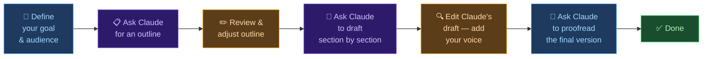

# 🤖 Day 15 — Writing Assistant: Drafts, Edits & Emails

[<< Day 14](../14_Day_Week2_Review/14_day_week2_review.md) | [Day 16 >>](../16_Day_Research_And_Summarization/16_day_research_and_summarization.md)

---

## 🎯 What You Will Learn Today

- The full range of writing tasks Claude can help with
- How to draft content from scratch using Claude
- How to edit and improve your own writing
- Writing professional emails for any situation
- Adjusting tone and style to fit your audience
- Practical workflows for writers at every level

---

## ✍️ Why Claude is a Powerful Writing Partner

Writing is one of the most time-consuming tasks in work and study. Claude can cut that time dramatically — not by replacing your voice, but by accelerating your process.

Claude can help you:

| Stage | What Claude Can Do |
|-------|--------------------|
| **Before writing** | Brainstorm ideas, create outlines, research structure |
| **While writing** | Draft sections, overcome writer's block, suggest transitions |
| **After writing** | Proofread, improve clarity, adjust tone, shorten or expand |
| **For specific formats** | Emails, reports, cover letters, proposals, social posts |

> 💡 **Important mindset:** Think of Claude as a writing collaborator, not a replacement. The best results come from you providing direction, content, and feedback — and Claude doing the heavy lifting.

---

## 📝 Drafting from Scratch

When you need to write something and don't know where to start, Claude is ideal.

### Getting an Outline First

Before asking for a full draft, ask for an outline. It's easier to steer Claude's structure before it writes than to restructure after.

```
Create a detailed outline for a blog post titled "5 Ways Remote Work 
Has Changed Company Culture Forever." The audience is HR managers 
at mid-sized companies. Include main sections and 2–3 bullet points 
per section.
```

Review the outline, adjust it, then ask Claude to write each section.

> 🧪 **Try this right now:** Think of something you've been meaning to write — an email, a post, a short report. Ask Claude for an outline first. Adjust one item you'd do differently, then ask it to write the first section only. Iteration beats one-shot every time.

---

### Drafting a Full Document

```
Write a first draft of a project proposal for the following:

Project: Installing solar panels on our company's warehouse
Audience: The board of directors (non-technical, focused on ROI)
Length: One page
Sections needed: Executive summary, cost breakdown, projected savings, 
                 recommendation
Tone: Professional and persuasive, not overly technical
```

---

### Beating Writer's Block

```
I'm writing an introduction for an article about the mental health 
benefits of exercise. I've been staring at a blank page for 20 minutes. 
Give me 5 different opening sentences I could use — ranging from 
surprising stat to personal anecdote to thought-provoking question.
```

---

## 🔧 Editing & Improving Your Writing

This is where Claude shines. Paste your existing text and ask for specific improvements.

### Improving Clarity

```
Rewrite the following paragraph to be clearer and more concise. 
Remove any redundancy and use simpler words where possible. 
Keep the same meaning.

[paste your paragraph]
```

---

### Fixing Grammar and Style

```
Proofread the following text. Correct any grammar, spelling, and 
punctuation errors. Also flag any sentences that are awkward or 
hard to read, and suggest rewrites.

[paste your text]
```

---

### Adjusting Tone

| Goal | Instruction |
|------|------------|
| More formal | "Rewrite this in a more professional, formal tone" |
| More casual | "Make this sound more conversational and friendly" |
| More confident | "Remove any hedging language and make this more assertive" |
| More empathetic | "Rewrite this to sound warmer and more understanding" |
| Shorter | "Cut this by 30% without losing the key points" |
| More detailed | "Expand this with more specific examples and explanation" |

---

### Getting Targeted Feedback

Instead of "Is this good?", ask for specific feedback:

```
Read this cover letter and give me:
1. The 3 strongest things about it
2. The 3 things that most need improvement
3. Any phrases that sound cliché or weak
4. A score out of 10 for overall impact

[paste cover letter]
```

---

## 📧 Professional Emails

Email is where Claude saves enormous time. Here are templates for common situations:

### Requesting a Meeting

```
Write a concise, professional email requesting a 30-minute meeting 
with a potential client I met at a conference last week. 
I want to discuss how our data analytics software could help their 
logistics company reduce costs. Keep it under 150 words.

My name: [your name]
Their name: [their name]
Company: [their company]
```

---

### Following Up (No Response)

```
Write a polite follow-up email to a recruiter who I applied to 
2 weeks ago. I haven't heard back. I want to express continued 
interest without seeming pushy. Keep it under 100 words.
```

---

### Delivering Bad News

```
Write a professional email to a client explaining that our project 
will be delayed by 2 weeks due to unexpected technical issues. 
The tone should be: apologetic but not groveling, honest about the 
cause, clear about the new timeline, and focused on solutions.
```

---

### Declining Politely

```
Write an email declining a meeting invitation from a vendor. 
I'm not interested in their product right now but want to leave 
the door open for the future. Keep it brief and professional.
```

---

## 🎨 Adjusting Style for Different Formats

### Social Media Posts

```
Rewrite this paragraph as 3 different social media posts:
1. LinkedIn — professional and insightful
2. Twitter/X — punchy, under 280 characters
3. Instagram — engaging, with emoji suggestions

Paragraph: [paste your content]
```

---

### Academic to Plain English

```
Rewrite this academic abstract in plain language that anyone 
could understand. Keep the key findings but remove jargon.

[paste abstract]
```

---

### Formal Report Language

```
I've written informal notes from a meeting. Rewrite them as a 
formal meeting summary suitable for distribution to senior management.

Notes: [paste notes]
```

---

## 🔄 A Practical Writing Workflow

Here's how to use Claude effectively for any writing task:



---

## ⚠️ Things to Keep in Mind

- **Add your voice:** Claude's drafts are a starting point. Edit them to sound like you.
- **Be specific:** The more detail you give, the less rewriting you'll do.
- **Verify facts:** Claude may include plausible-sounding but incorrect details. Always check facts in important documents.
- **Iterate:** Don't accept the first draft if it's not right. Guide Claude with specific feedback.

---

## 📋 Summary

🌕 Day 15 complete! Here's what you learned:

- Claude can help at every stage: brainstorming, outlining, drafting, editing, and proofreading
- **Drafting:** Get an outline first, then draft section by section
- **Editing:** Give Claude specific tasks (clarity, tone, length, grammar) — not just "make it better"
- **Emails:** Provide context (who, to whom, purpose, tone) and you'll get excellent results
- **Style:** Claude can reformat content for LinkedIn, Twitter, reports, and more
- Always add your own voice to Claude's drafts

---

## 🏋️ Exercises

### 🟢 Level 1 — Beginner

1. Ask Claude to write a professional email you actually need to send this week. Edit it to match your voice, then use it.
2. Paste a paragraph you've written recently and ask Claude to (a) make it more concise and (b) adjust the tone to be more confident. Compare the versions.
3. Ask Claude for 5 opening sentences for something you're writing (a message, an article, a report). Pick your favourite and continue from there.

### 🟡 Level 2 — Intermediate

4. Use the full writing workflow: define a task → get an outline → draft section by section → edit and add your voice → proofread. Document how long it takes vs. writing from scratch.
5. Ask Claude to rewrite the same paragraph in 3 different tones (formal, casual, persuasive). Analyse how the word choices and sentence structure change between versions.
6. Give Claude a piece of your writing and ask for specific, scored feedback (strengths, weaknesses, score out of 10). How useful is the feedback?

### 🔴 Level 3 — Challenge

7. Use Claude to draft a full document you've been putting off — a report, proposal, article, or letter. Track how the final version compares to Claude's first draft. What did you change and why?
8. Create a "writing style guide" for yourself. Show Claude 3–4 examples of your best writing, then ask it to describe your style. Use this as a few-shot base for future writing tasks.
9. Research: What are the ethical considerations around using AI for professional writing? When should you disclose AI assistance? What are the different norms across industries (journalism, academia, marketing, legal)?

---

## 📢 Share Your Output

You just used Claude to write something real. Don't let it sit in a tab.

> 🌍 **Post what you made** — an email, a draft, a document — on LinkedIn, X, or Instagram with **[#30DaysOfClaude](https://github.com/amir-sharfu/30-Days-of-Claude/issues/1)**.
>
> Drop it in the **[community thread on GitHub](https://github.com/amir-sharfu/30-Days-of-Claude/issues/1)** too — your output might be the thing that convinces someone else to start this course.

---

🧡🧡🧡 HAPPY LEARNING 🧡🧡🧡

[<< Day 14](../14_Day_Week2_Review/14_day_week2_review.md) | [Day 16 >>](../16_Day_Research_And_Summarization/16_day_research_and_summarization.md)
