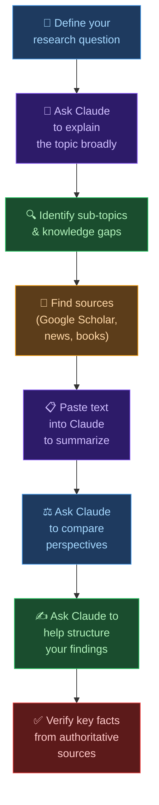

# 🤖 Day 16 — Research & Summarization

[<< Day 15](../15_Day_Writing_Assistant/15_day_writing_assistant.md) | [Day 17 >>](../17_Day_Code_Understanding/17_day_code_understanding.md)

---

## 🎯 What You Will Learn Today

- How to use Claude as a research and synthesis tool
- Techniques for summarizing long texts effectively
- How to compare perspectives and extract key insights
- How to build a research workflow using Claude
- The critical limitations you must always keep in mind

---

## 🔍 Claude as a Research Tool

Claude isn't a search engine — it can't browse the internet by default or retrieve today's news. But what it *can* do is something equally valuable: **synthesize, explain, and organize information** in ways that would take you hours to do manually.

| What Claude Can Do | What Claude Cannot Do |
|-------------------|----------------------|
| Explain complex topics clearly | Browse the internet in real time |
| Summarize documents you paste | Access paywalled articles |
| Compare and contrast ideas | Retrieve current prices, news, or data |
| Identify patterns in text | Verify its own facts automatically |
| Create structured summaries | Guarantee citation accuracy |
| Generate research questions | Replace a subject-matter expert |

> ⚠️ **Always remember:** Claude's knowledge has a training cutoff. For current events, recent research, or real-time data, verify with up-to-date sources.

---

## 📄 Summarizing Long Documents

This is one of Claude's most powerful everyday uses. You can paste text directly — articles, reports, meeting transcripts, research papers — and ask Claude to summarize it.

### Simple Summary

```
Summarize the following article in 3 bullet points. 
Focus on the main argument and key evidence.

[paste article text]
```

---

### Executive Summary

```
Write a one-paragraph executive summary of the following report. 
The audience is senior management who won't read the full document. 
Highlight the key findings, recommendations, and any risks.

[paste report]
```

---

### Structured Extraction

```
Read the following research paper and extract:
1. The main research question
2. The methodology used
3. The key findings
4. The limitations the authors acknowledge
5. The implications for practitioners

[paste paper]
```

---

### Summarizing for Different Audiences

```
Summarize this scientific study twice:
1. For a general audience with no science background (plain English, 
   no jargon, use an analogy)
2. For a professional audience in the same field (technical, 
   use correct terminology)

[paste study]
```

---

## 🧩 Explaining Complex Topics

Don't have a long document? You can ask Claude to explain any topic it knows — with the caveat that you should verify important facts.

### Ask for Layered Explanation

```
Explain quantum computing. Give me:
1. A 2-sentence summary for a complete beginner
2. A 1-paragraph overview for someone with a basic science background
3. A more detailed explanation covering the key concepts: qubits, 
   superposition, and entanglement
```

---

### Use Analogies to Build Understanding

```
Explain how the immune system works using only analogies 
from everyday life. No medical jargon.
```

---

### Connecting Concepts

```
Explain the relationship between inflation, interest rates, and 
unemployment. How do these three things affect each other? 
Use a simple example with numbers.
```

---

## ⚖️ Comparing & Contrasting

Claude excels at presenting multiple perspectives on a topic in a structured, balanced way.

### Side-by-Side Comparison

```
Create a comparison table of these three project management 
methodologies: Agile, Waterfall, and Kanban. 

Columns: definition, best use case, main advantages, main 
disadvantages, team size it suits.
```

---

### Balanced Perspectives

```
Present the strongest arguments FOR and AGAINST remote work 
becoming the permanent default for office jobs. Give each side 
equal weight. Don't tell me your conclusion — just present 
both sides clearly.
```

---

### Historical vs. Current Views

```
How has the scientific understanding of diet and heart disease 
changed from the 1950s to today? What was believed then vs. now, 
and what caused the shift in thinking?
```

---

## 🗂️ Building a Research Workflow

Here's a practical workflow for using Claude in a research project:



---

## 🔑 Techniques for Better Research Prompts

### Ask for Research Questions First

```
I'm writing a report on the impact of social media on teenage 
mental health. Generate 10 good research questions I should 
try to answer, organized from foundational to advanced.
```

---

### Ask for What You Might Be Missing

```
I'm researching electric vehicle adoption. Here's what I've 
covered so far: [list your topics].

What important angles, counterarguments, or related topics 
am I missing that I should also research?
```

---

### Cross-Check Your Understanding

```
Here's my summary of what I've learned about blockchain technology:
[paste your summary]

Is this accurate? What did I get wrong, oversimplify, or miss?
```

---

## ⚠️ Research Limitations — Critical Reminders

| Risk | What to Do |
|------|-----------|
| **Hallucinated citations** | Never use a citation Claude gives you without searching for it yourself |
| **Outdated information** | Check when information was last updated for fast-moving topics |
| **Confident errors** | Claude sounds certain even when wrong — verify important facts |
| **Missing nuance** | Claude may oversimplify complex debates — dig deeper |
| **Bias in training data** | Claude may reflect biases present in its training — read critically |

> ⚠️ **The golden rule of research with Claude:** Use it to explore, understand, and organize — but verify anything important with authoritative primary sources.

---

## 📋 Summary

🌕 Day 16 complete! Here's what you learned:

- Claude is a **synthesis and explanation tool**, not a search engine
- **Summarization:** Paste text and get bullet points, executive summaries, or structured extractions
- **Explanation:** Ask Claude to explain any topic at multiple levels using analogies
- **Comparison:** Claude creates structured comparisons and balanced perspectives
- **Research workflow:** Use Claude to explore broadly, identify gaps, and organize findings
- **Critical limitation:** Always verify facts and citations from authoritative sources

---

## 🏋️ Exercises

### 🟢 Level 1 — Beginner

1. Find a long article or report you need to read for work or study. Paste it into Claude and ask for a 5-bullet-point summary. How accurate is it?
2. Ask Claude to explain a topic you've always found confusing using a simple analogy. Does it help?
3. Ask Claude: "What are the most important things I should know about [topic you're researching]?" Then fact-check 3 of its claims using a reliable source.

### 🟡 Level 2 — Intermediate

4. Use Claude to compare two products, approaches, or theories in your field. Ask for a structured comparison table. How useful is this for making a decision?
5. Paste text from two sources with different viewpoints on the same topic. Ask Claude to identify where they agree and disagree, and what assumptions each side makes.
6. Use Claude to generate 10 research questions for a topic you're working on. Rank them by importance. Which ones would you not have thought of yourself?

### 🔴 Level 3 — Challenge

7. Run a full research session using the workflow from today: topic → broad explanation → sub-topics → paste real sources → compare perspectives → structure findings. Write up the output.
8. Ask Claude to summarize the same document for 3 different audiences (expert, general public, executive). Analyse how Claude changes the language, structure, and focus.
9. Test Claude's accuracy: ask it to explain a topic you're an expert in. Identify every error, oversimplification, or omission. What does this tell you about how to use Claude for research in your own field?

---

🧡🧡🧡 HAPPY LEARNING 🧡🧡🧡

[<< Day 15](../15_Day_Writing_Assistant/15_day_writing_assistant.md) | [Day 17 >>](../17_Day_Code_Understanding/17_day_code_understanding.md)
