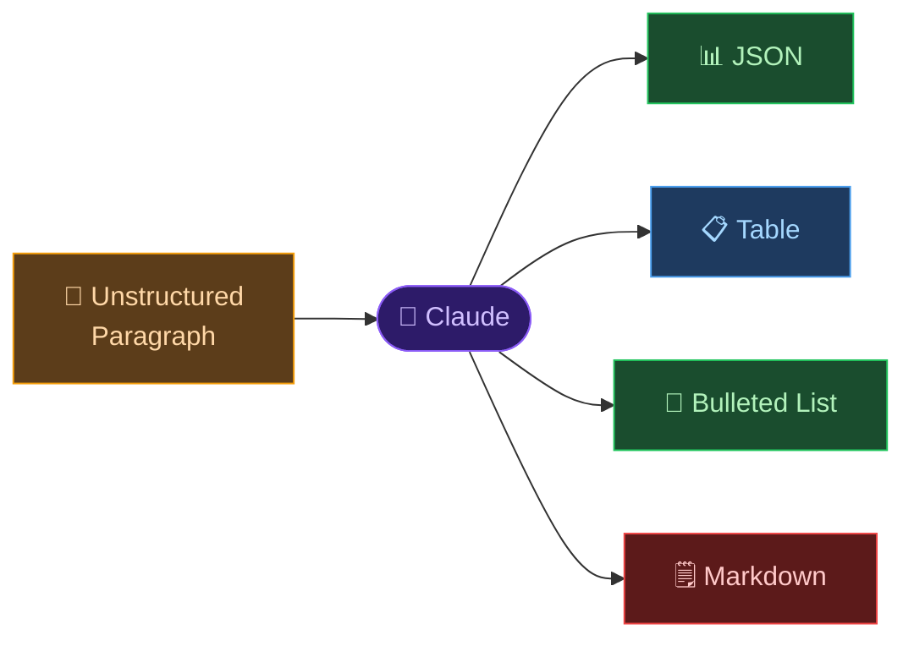

# 🤖 Day 22 — Structured Output: JSON, Tables & Lists

[<< Day 21](../21_Day_Creative_Writing/21_day_creative_writing.md) | [Day 23 >>](../23_Day_Multi_Turn_Conversations/23_day_multi_turn_conversations.md)

---

## 🎯 What You Will Learn Today

- Why structured output matters for real-world use
- How to get Claude to produce JSON, tables, and lists reliably
- How to extract structured data from unstructured text
- How to use Markdown formatting for clean, readable output
- How structured output powers automation and integration

---

## 📐 Why Structure Matters

When you use Claude for personal tasks, natural prose responses are fine. But when Claude's output needs to be:

- **Copied into a spreadsheet**
- **Pasted into a database**
- **Processed by another program**
- **Displayed consistently in a report**
- **Sent to an API or integration**

…you need **structured output** — data in a predictable, consistent format that both humans and machines can read reliably.



---

## 🗂️ JSON Output

JSON (JavaScript Object Notation) is the standard format for exchanging data between programs. Claude can produce valid JSON reliably when you ask for it clearly.

### Basic JSON Request

```
Extract the following information from this job posting and 
return it as a JSON object:

Fields: job_title, company, location, salary_range, 
        required_experience_years, key_skills (array), 
        remote (boolean), application_deadline

Job posting:
[paste job posting text]
```

Claude returns:
```json
{
  "job_title": "Senior Product Manager",
  "company": "TechCorp Ltd",
  "location": "London, UK",
  "salary_range": "£70,000 - £90,000",
  "required_experience_years": 5,
  "key_skills": ["roadmap planning", "stakeholder management", "agile", "data analysis"],
  "remote": true,
  "application_deadline": "2024-03-15"
}
```

---

### JSON Arrays

```
I have 5 customer complaints below. Parse each one into a JSON array. 
Each object should have: id (1-5), category, sentiment (positive/negative/neutral), 
priority (high/medium/low), and a one-sentence summary.

Complaint 1: [text]
Complaint 2: [text]
...
```

---

### Nested JSON

```
Create a JSON structure for a restaurant menu with the following rules:
- Top level: restaurant name, cuisine type, and an array of categories
- Each category has: name and an array of items
- Each item has: name, description, price, and dietary tags (array)

Use this data:
[paste menu information]
```

---

### Ensuring Valid JSON

Add these instructions to get cleaner output:

```
Return ONLY valid JSON — no explanation, no markdown code blocks, 
no additional text. The output must be parseable by JSON.parse().
```

---

## 📊 Table Output

Tables are perfect for comparisons, structured lists, and reports meant for humans.

### Comparison Table

```
Create a comparison table of these 5 project management tools:
Jira, Trello, Asana, Monday.com, and Notion.

Columns: Tool, Best for (team size), Pricing model, Key strength, 
Key weakness, Free tier available (yes/no)

Format it as a Markdown table.
```

---

### Data Extraction to Table

```
Read the following product reviews and extract key information 
into a Markdown table.

Columns: Reviewer name, Rating (1-5), Product liked most, 
Main complaint, Would recommend (yes/no/maybe)

Reviews:
[paste reviews]
```

---

### Report Table

```
I'll give you quarterly sales figures. Create a Markdown table that includes:
- The raw figures
- Quarter-over-quarter percentage change
- Whether each quarter was above or below the annual average

Data:
Q1: £124,000
Q2: £138,000
Q3: £119,000
Q4: £187,000
```

---

## 📝 Lists — Bulleted and Numbered

### Bulleted Lists for Reference

```
List the 10 most important keyboard shortcuts in VS Code.
Format as a bulleted list with the shortcut on the left 
and the function on the right. Group by category 
(Navigation, Editing, Search).
```

---

### Numbered Lists for Processes

```
Write a numbered step-by-step guide for setting up a new MacBook 
for a software developer. Each step should be actionable and specific.
Group the steps under these headers:
1. System Setup
2. Developer Tools
3. Applications
4. Security
```

---

### Nested Lists

```
Create a nested list outlining the structure of a marketing strategy 
document. Top level: major sections. Second level: subsections. 
Third level (where appropriate): specific elements to address.
```

---

## 🔄 Extracting Structure from Unstructured Text

One of the most powerful uses of structured output: turning messy text into clean, usable data.

### Meeting Notes → Action Items

```
Read these rough meeting notes and extract:
1. A bulleted list of decisions made
2. A table of action items with columns: Task, Owner, Deadline
3. A bulleted list of open questions that still need answers

Meeting notes:
[paste notes]
```

---

### Article → Key Facts

```
Extract all factual claims from this article into a numbered list. 
For each claim, note whether it includes a source or not.

[paste article]
```

---

### CV/Resume → Structured Profile

```
Parse this CV into a JSON object with the following structure:
{
  "name": "",
  "email": "",
  "phone": "",
  "summary": "",
  "experience": [{"company": "", "role": "", "dates": "", "bullets": []}],
  "education": [{"institution": "", "degree": "", "year": ""}],
  "skills": []
}

CV text:
[paste CV]
```

---

## 🎨 Markdown Formatting

Markdown is the standard format for Claude's responses and is supported by GitHub, Notion, Slack, and many other tools.

### Requesting a Formatted Document

```
Write a project brief for a new mobile app, formatted as a 
professional Markdown document with:
- An H1 title
- H2 sections: Overview, Goals, Target Audience, Key Features, 
  Timeline, Budget
- Bullet points under each section
- A table for the feature list (Feature | Priority | Effort)
- A blockquote for the core value proposition
```

---

### Controlling Output Format

| If you want... | Add this to your prompt |
|---------------|------------------------|
| Plain text only | "No markdown, plain text only" |
| Markdown headers | "Use H2 (##) for sections" |
| Code blocks | "Put all code in fenced code blocks with the language specified" |
| No bullet points | "Use numbered lists, not bullets" |
| Tables only | "Present all comparisons as Markdown tables" |

---

## 🤖 Structured Output for Automation

When Claude's output feeds into another tool or process, consistency is critical. Use this pattern:

```
You are a data extraction assistant. For every product description 
I send you, return ONLY a JSON object in exactly this format:

{
  "name": "string",
  "price": number,
  "currency": "string",
  "category": "string",
  "in_stock": boolean,
  "tags": ["string"]
}

Do not include any other text. If a field is not found, use null.

First product description:
[paste description]
```

This is the foundation of building Claude into data pipelines and workflows — which you'll learn more about on Days 27 and 28.

---

## 📋 Summary

🌕 Day 22 complete! Here's what you learned:

- **Structured output** makes Claude's responses usable by other systems, tools, and workflows
- **JSON:** Ask explicitly for valid JSON; specify the exact schema; use for machine-readable data
- **Tables:** Perfect for comparisons and reports; use Markdown table format
- **Lists:** Bulleted for reference; numbered for processes; nested for hierarchies
- **Extraction:** Claude can parse unstructured text (meeting notes, CVs, articles) into clean structure
- **Automation:** Consistent output format + clear schema = Claude as a data processing engine

---

## 🏋️ Exercises

### 🟢 Level 1 — Beginner

1. Paste a job advertisement into Claude and ask it to extract 6 key fields as a JSON object. Verify the JSON is valid by pasting it into a JSON validator online.
2. Ask Claude to compare 4 products or tools you use and format the comparison as a Markdown table. Copy the table into a document — does it render correctly?
3. Give Claude a set of rough bullet points and ask it to transform them into a structured numbered process with sub-steps.

### 🟡 Level 2 — Intermediate

4. Paste messy meeting notes into Claude and ask it to extract: decisions, action items (with owners and deadlines), and open questions — as separate structured sections.
5. Ask Claude to produce a JSON array of 10 fictional user profiles with fields: name, age, occupation, city, and 3 interests. Then ask it to filter the array to users over 30 (Claude will rewrite the filtered version).
6. Design a prompt that extracts structured data from 5 different product reviews. Make the output consistent enough that you could paste it directly into a spreadsheet.

### 🔴 Level 3 — Challenge

7. Build a multi-step extraction pipeline: (a) paste a real document, (b) extract structured JSON, (c) ask Claude to validate the JSON for completeness and flag any missing fields, (d) ask Claude to convert the JSON to a Markdown table for a report.
8. Design a "data extraction template" prompt for a document type you regularly process (invoices, contracts, job postings, reports). Make the JSON schema precise enough that every extraction is consistent.
9. Research: What is JSON Schema validation? How do developers use Claude's structured outputs in production systems? What are the risks of relying on LLM output in data pipelines?

---

🧡🧡🧡 HAPPY LEARNING 🧡🧡🧡

[<< Day 21](../21_Day_Creative_Writing/21_day_creative_writing.md) | [Day 23 >>](../23_Day_Multi_Turn_Conversations/23_day_multi_turn_conversations.md)
