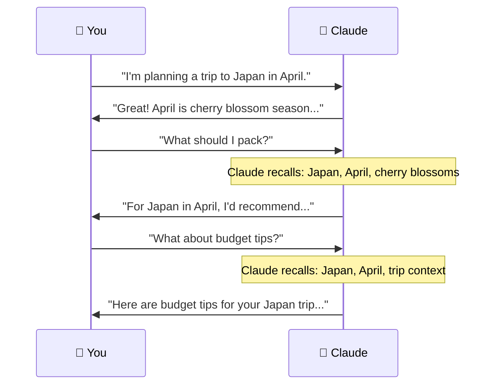
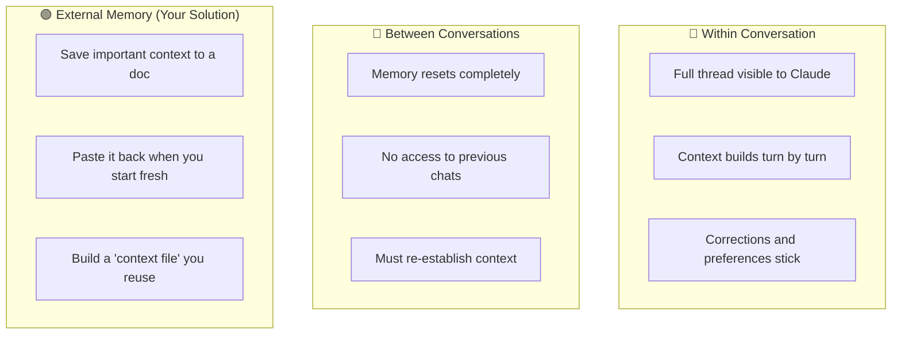

# 🤖 Day 23 — Multi-Turn Conversations & Memory

[<< Day 22](../22_Day_Structured_Output/22_day_structured_output.md) | [Day 24 >>](../24_Day_Claude_For_Business/24_day_claude_for_business.md)

---

## 🎯 What You Will Learn Today

- How Claude remembers (and forgets) information within a conversation
- How to build on previous messages to get better results
- How to correct, redirect, and refine across multiple turns
- Strategies for keeping long conversations focused and effective
- The difference between conversation memory and external memory

---

## 💬 How Multi-Turn Conversations Work

When you chat with Claude on claude.ai, each conversation is a **thread** — a connected sequence of messages. Claude reads the entire thread every time you send a new message, so it can refer back to anything you said earlier.



This is why you don't have to repeat yourself in every message — Claude builds context as you go.

---

## 🧠 What Claude Remembers (Within a Conversation)

Within a single conversation, Claude remembers:

| ✅ Claude Remembers | ❌ Claude Does NOT Remember |
|--------------------|---------------------------|
| Everything you've said in this conversation | Previous conversations |
| What it has already told you | Your name or preferences from other sessions |
| Files or text you've pasted | Real-time information (today's date, live data) |
| Instructions you've given | Anything outside this conversation window |
| Corrections you've made | Information from other users |

> 💡 **Key insight:** Every new conversation starts completely fresh. Claude has no memory of what you discussed yesterday, last week, or in a different chat window.

---

## 🔄 Building Context Across Turns

The power of multi-turn conversations is that you can **build** toward a goal incrementally rather than writing one massive prompt.

### Strategy 1: Start Broad, Then Narrow

```
Turn 1: "I want to write a business plan for a dog grooming service."

Turn 2: "Great. Let's focus on the financial section first. 
What are the key costs I should include?"

Turn 3: "Assume I'm starting with £5,000. What would a realistic 
first-month budget look like based on those costs?"

Turn 4: "Now write that into a proper financial overview section 
for the plan."
```

Each turn builds on the last, and Claude maintains the context of your dog grooming business throughout.

---

### Strategy 2: Iterate and Refine

Multi-turn conversations are perfect for getting something from "good" to "great":

```
Turn 1: "Write a tagline for my online tutoring service."

Turn 2: "I like the second one. Can you give me 5 variations 
of that one — make them shorter and more energetic."

Turn 3: "Good — now try making them suitable for a parent 
audience rather than students."

Turn 4: "Perfect. Now write a 50-word pitch paragraph that 
uses that tagline."
```

---

### Strategy 3: Teach Claude Your Preferences

You can give Claude instructions early in the conversation that affect all future responses:

```
"Before we start: I prefer bullet points over paragraphs. 
Keep responses under 200 words unless I ask for more. 
Always give me 3 options when making suggestions.

Now — help me plan my week."
```

Claude will apply these preferences throughout the rest of the conversation.

---

## ✍️ Correcting and Redirecting Claude

When Claude's response isn't quite right, you can correct it naturally — just like you would in a human conversation.

### Correcting Facts or Direction

```
You: "Write me a cover letter for a marketing role."
Claude: [writes cover letter]
You: "Actually, I have 8 years of experience, not 3. 
Also, this is for a senior role. Please rewrite it."
```

### Redirecting Tone or Style

```
You: "Make it less formal — I'm applying to a startup, 
not a law firm."
```

### Asking Claude to Undo

```
You: "That was too long. Give me a shorter version — 
3 sentences maximum."
```

### Branching Off

```
You: "Before we continue with the cover letter — 
can you quickly help me choose between two job titles 
for my CV? I'll come back to the letter after."
```

---

## 📌 Keeping Long Conversations on Track

Long conversations can drift. Here are techniques to keep things focused:

### Summarize and Reset

```
"Let's summarize where we are: you've helped me outline 
3 sections of the report. Now I want to move on to 
the conclusions section."
```

### Refer Back Explicitly

```
"Remember the persona you created for me earlier — 
the 'Budget-Conscious Parent'? Use that persona to 
rewrite this email."
```

### Correct Course

```
"I think we've gone off-track. Let's ignore the last 
few messages and go back to focusing on the introduction."
```

### Start Fresh When Needed

If a conversation has become too tangled, it's often better to start a new one with a clean, well-structured prompt that includes the key context you've learned.

---

## 🗂️ Conversation Memory vs. External Memory

Claude's in-conversation memory is powerful — but it's temporary. Once the conversation ends, it's gone.



### Building a Personal Context File

If you work with Claude regularly, maintain a short document with your key context:

```
[MY CONTEXT — paste this at the start of relevant conversations]

I'm a freelance graphic designer. My clients are mostly small 
businesses in the food industry. I prefer:
- Bullet points over long paragraphs
- Plain English, no jargon
- British English spelling
- 3 options when brainstorming

Current project: rebranding a bakery called "The Golden Loaf" 
in Bristol. Target audience: young professionals aged 25–40.
```

---

## 🔢 Context Window: What It Is

Every AI model has a **context window** — the maximum amount of text it can "see" at once. Think of it like working memory.

| Model | Context Window |
|-------|---------------|
| Claude Haiku | Large (handles most conversations easily) |
| Claude Sonnet | Very large (handles long documents + conversation) |
| Claude Opus | Largest (handles book-length content) |

In practice, you rarely hit context limits in normal conversations. But if you're working with very long documents AND a long conversation, you may notice Claude starting to "forget" earlier details.

**Signs you're approaching the limit:**
- Claude repeats itself
- Claude seems to forget earlier instructions
- Responses become less precise

**Fix:** Start a new conversation with a focused summary of what you need.

---

## 💡 Multi-Turn Conversation Patterns

### The Workshop Pattern
```
Turn 1: "Generate a first draft"
Turn 2: "Now improve the opening"  
Turn 3: "Make it shorter"
Turn 4: "Change the tone"
Turn 5: "Final polish — output the complete version"
```

### The Expert Panel Pattern
```
Turn 1: "Act as a financial advisor. Review my budget below..."
Turn 2: "Now switch roles — respond as a frugal lifestyle blogger."
Turn 3: "Now combine both perspectives into one recommendation."
```

### The Research Pattern
```
Turn 1: "Explain [topic] in overview"
Turn 2: "Go deeper on [specific aspect]"
Turn 3: "What are the counterarguments?"
Turn 4: "Summarize everything as a one-page brief"
```

---

## 📋 Summary

🌕 Day 23 complete! Here's what you learned:

- **Multi-turn memory:** Claude reads the entire conversation thread each time, building context as you go
- **No cross-session memory:** Every new conversation starts fresh — Claude forgets everything when the chat ends
- **Build incrementally:** Start broad, then narrow — use turns to refine, iterate, and improve
- **Teach preferences early:** Give instructions at the start of a conversation that apply to all subsequent turns
- **Correct naturally:** Just tell Claude what to change — no need to start over
- **Context window:** Has limits, but is very large — start fresh if conversations get tangled
- **External memory:** Keep a personal context file and paste it at the start of new conversations

---

## 🏋️ Exercises

### 🟢 Level 1 — Beginner

1. Start a multi-turn conversation with Claude about planning a fictional holiday. In turn 1, give the destination. In turn 2, ask about accommodation. In turn 3, ask for a packing list. Notice how Claude retains context.
2. Give Claude a writing task, then use 3 follow-up messages to refine it (change tone, length, and one specific detail). See how iterative improvement works.
3. At the start of a conversation, tell Claude your preferences (bullet points, short responses, etc.). Then have a 5-turn conversation. Does Claude maintain your preferences throughout?

### 🟡 Level 2 — Intermediate

4. Have a 10-turn conversation where you progressively build a complete document (outline → sections → full draft → final edit). Track how Claude's context awareness helps.
5. Create a personal context file for yourself — your role, current project, preferences, and writing style. Paste it into a new conversation and see how it shapes Claude's responses compared to a fresh start.
6. Deliberately push a conversation in the wrong direction, then use a "reset" message to bring it back on track. How effectively does Claude respond to course corrections?

### 🔴 Level 3 — Challenge

7. Design a multi-turn "workshop" conversation where you start with a rough idea and refine it over 15+ turns into a polished final output. Document your prompting strategy at each stage.
8. Test Claude's context limits: start a very long conversation with a large document + lots of back-and-forth. At what point does Claude start to "forget" earlier details? What workarounds work best?
9. Research: How do AI memory systems differ across models and products? What is "retrieval-augmented generation" (RAG)? How do tools like Claude's Projects feature extend memory beyond a single conversation?

---

🧡🧡🧡 HAPPY LEARNING 🧡🧡🧡

[<< Day 22](../22_Day_Structured_Output/22_day_structured_output.md) | [Day 24 >>](../24_Day_Claude_For_Business/24_day_claude_for_business.md)
