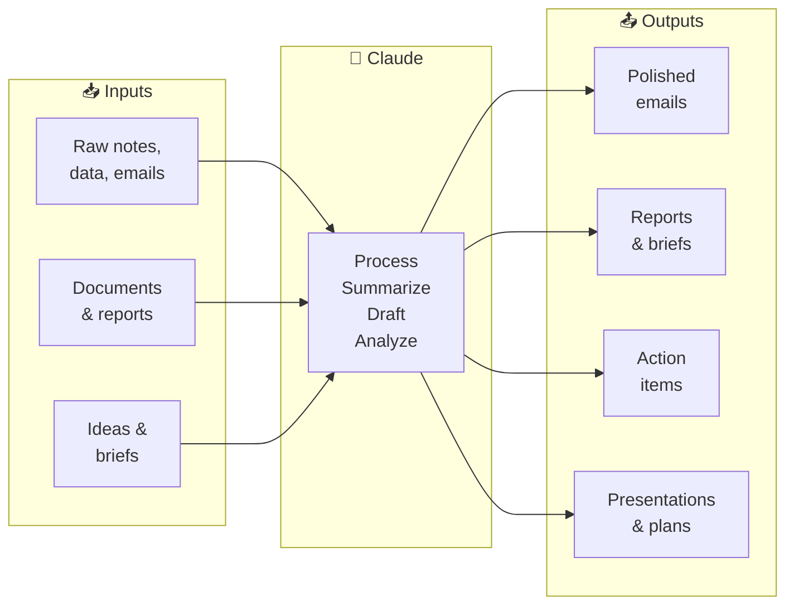

# 🤖 Day 24 — Claude for Business & Productivity

[<< Day 23](../23_Day_Multi_Turn_Conversations/23_day_multi_turn_conversations.md) | [Day 25 >>](../25_Day_System_Prompts/25_day_system_prompts.md)

---

## 🎯 What You Will Learn Today

- How businesses use Claude to save time and improve output
- Practical prompts for the most common business tasks
- How to use Claude for meetings, reports, email, and HR
- How to build repeatable Claude workflows for your team
- What to watch out for when using Claude at work

---

## 🏢 Claude in the Workplace

Claude isn't just a personal productivity tool — it's increasingly used inside businesses to speed up repetitive tasks, improve communication quality, and free up human time for higher-value work.



---

## 📧 Email & Communication

### Drafting Professional Emails

```
Draft a professional email to a client explaining that their 
project will be delayed by 2 weeks due to a supplier issue. 
Tone: apologetic but confident. Include:
- An acknowledgement of the inconvenience
- A brief, honest explanation (no technical jargon)
- A revised timeline
- What we're doing to prevent this happening again
- An offer for a call to discuss further
```

---

### Responding to Difficult Messages

```
I've received this complaint email from a customer. 
Draft a response that:
- Acknowledges their frustration without admitting liability
- Offers a concrete next step
- Keeps the door open for resolution
- Is polite but not overly apologetic

Email: [paste email]
```

---

### Email Triage

```
I have these 8 emails in my inbox. For each one, give me:
1. A one-sentence summary
2. Priority (high/medium/low)
3. Suggested action (reply, forward, archive, delegate)
4. A draft reply if action is "reply"

[paste email list]
```

---

## 📋 Meetings

### Pre-Meeting Preparation

```
I have a meeting tomorrow with a new client — a retail company 
that wants to improve their online presence. The meeting is 60 
minutes. Help me:
1. A list of 10 questions to ask them
2. A suggested agenda with time allocations
3. Key information I should know about the retail industry's 
   current digital challenges
```

---

### Meeting Notes → Action Items

```
Here are my rough notes from today's project kickoff meeting. 
Please extract:
1. A bullet list of all decisions made
2. A table of action items with: Task | Owner | Deadline
3. A list of open questions that still need answers
4. A 3-bullet summary I can send to the team

Meeting notes:
[paste notes]
```

---

### Writing Meeting Agendas

```
Write a professional agenda for a 45-minute quarterly review 
meeting with my team. Include:
- Welcome and housekeeping (5 min)
- Q2 performance review
- Key wins and lessons learned
- Q3 goals and priorities
- Open discussion and questions
- Next steps

Format it as a clear agenda with time allocations.
```

---

## 📊 Reports & Documents

### Executive Summary

```
Here is a 15-page internal report on our Q2 marketing performance. 
Write an executive summary of 250–300 words that covers:
- Overall performance vs. targets
- 3 key wins
- 2 areas of concern
- Top recommendation

Use bullet points where possible. Audience: senior leadership 
who won't read the full report.

[paste report]
```

---

### Status Update

```
Write a weekly status update email for my project — 
building a new customer portal — using this information:

Completed this week: user authentication, login page design
In progress: dashboard layout, data integration
Blockers: waiting on API access from the data team
Next week: complete dashboard, start testing

Format: professional but informal, suitable for 
sending to my manager and stakeholders.
```

---

### Turning Data Into a Narrative

```
Here are our monthly sales figures for Q2:
April: £142,000 (target: £130,000)
May: £127,000 (target: £135,000)
June: £168,000 (target: £150,000)

Write a 3-paragraph narrative for our board report that:
- Explains the overall Q2 picture positively
- Addresses the May dip without making excuses
- Highlights the June recovery as momentum
```

---

## 🤝 HR & People Operations

### Job Descriptions

```
Write a job description for a Senior Marketing Manager role at 
a London-based fintech startup (Series B, 80 employees).

Include: role overview, key responsibilities (8 bullet points), 
required experience, nice-to-have skills, what we offer.
Tone: professional but not corporate — we want to attract 
people who want to build something.
```

---

### Performance Review Feedback

```
I need to write performance review feedback for a team member. 
Here are my rough notes:

Strengths: always delivers on time, great with clients, 
proactive, strong technical skills in data analysis
Development areas: sometimes takes too long making decisions, 
needs to delegate more, can be too detail-focused in meetings

Turn these into professional, constructive review language 
with specific suggestions for growth.
```

---

### Onboarding Documents

```
Create a first-day onboarding guide for a new team member 
joining our 25-person digital marketing agency. Include:
- Welcome message
- Who's who (I'll fill in names)
- First week schedule template
- Where to find key tools and information
- Do's and don'ts of our team culture
- Who to contact for different things
```

---

## 📈 Strategy & Planning

### SWOT Analysis

```
I run a small independent coffee shop in a city centre. 
We've been open 3 years, have 4 staff, and serve about 
150 customers per day. A major coffee chain is opening 
nearby next month.

Help me create a SWOT analysis and suggest 3 strategic 
responses based on the threats.
```

---

### Business Writing

```
Write a 1-page business case for investing £20,000 in a 
new customer relationship management (CRM) system for our 
sales team of 12 people.

Include: problem statement, proposed solution, expected 
benefits, estimated ROI, risks, recommendation.
Audience: the finance director.
```

---

## ⚠️ What to Watch Out For at Work

| Risk | What to Do |
|------|-----------|
| **Confidential data** | Never paste client names, personal data, or proprietary financials into claude.ai (the free chat version) |
| **AI hallucination** | Always verify facts, statistics, and dates that Claude generates |
| **Generic output** | Add specific context — Claude works much better with real details |
| **Over-reliance** | Use Claude to draft, not to decide — human judgment still matters |
| **Tone mismatch** | Always read and edit Claude's output before sending to clients or leadership |
| **Copyright** | Claude's output is yours to use, but be careful using content that mimics a specific author or brand |

> ⚠️ **Data Privacy:** For sensitive work tasks, check whether your company has a Claude Teams or Enterprise plan — these offer stronger data privacy controls than the free public product.

---

## 🔁 Building Repeatable Business Workflows

The real power comes from creating **reusable prompt templates** for tasks you do repeatedly.

### Example: Weekly Report Template

```
[WEEKLY REPORT TEMPLATE — paste at start of conversation]

You are helping me write my weekly project update.

My role: Project Manager at [company]
My project: [project name]
Report audience: My manager and project stakeholders
Tone: Professional and concise

I will give you bullet points. You will turn them into 
a professional weekly status update in this format:
- Subject line
- 2-sentence overall summary
- Completed this week (bullets)
- In progress (bullets)
- Blockers or risks (bullets)
- Next week priorities (bullets)

Ready? Here are my bullet points:
[paste your notes]
```

Save this template. Paste it every week. Consistent output in seconds.

---

## 📋 Summary

🌕 Day 24 complete! Here's what you learned:

- **Email:** Draft, respond to difficult messages, triage your inbox — Claude handles the heavy lifting
- **Meetings:** Pre-meeting prep, notes → action items, agenda writing
- **Reports:** Executive summaries, status updates, turning data into narrative
- **HR:** Job descriptions, performance feedback, onboarding materials
- **Strategy:** SWOT analysis, business cases, planning documents
- **Templates:** Build reusable prompt templates for tasks you do every week
- **Caution:** Never paste confidential data into public AI tools; always review output before sending

---

## 🏋️ Exercises

### 🟢 Level 1 — Beginner

1. Think of a recurring email you write at work (a weekly update, a meeting request, a follow-up). Ask Claude to write a template for it. Test it with real content.
2. Paste the rough notes from a recent meeting into Claude and ask it to extract decisions, action items, and open questions. How accurate is it?
3. Ask Claude to write a job description for your own current role. How close is it to reality? What would you change?

### 🟡 Level 2 — Intermediate

4. Create a complete "email triage" prompt using 5 real (anonymized) emails from your inbox. Ask Claude to prioritize them and draft responses. Evaluate the drafts.
5. Write a prompt template for a business task you repeat weekly or monthly. Test it 3 times with real data. Refine the prompt until the output is consistently useful.
6. Use Claude to help you prepare for a real upcoming meeting: questions to ask, an agenda, and background research on the topic. Evaluate how useful the prep was after the meeting.

### 🔴 Level 3 — Challenge

7. Build a complete "end-of-week reporting" workflow: rough bullet notes → Claude drafts status update → you review and edit → final version. Time how long it takes compared to writing from scratch.
8. Identify 3 documents your team creates regularly that could be templated with Claude. Build prompt templates for all 3 and share them with your team.
9. Research: What is Claude for Work / Claude Teams? How does it differ from the free product in terms of data privacy, team features, and admin controls? What are the pricing models for business use?

---

🧡🧡🧡 HAPPY LEARNING 🧡🧡🧡

[<< Day 23](../23_Day_Multi_Turn_Conversations/23_day_multi_turn_conversations.md) | [Day 25 >>](../25_Day_System_Prompts/25_day_system_prompts.md)
