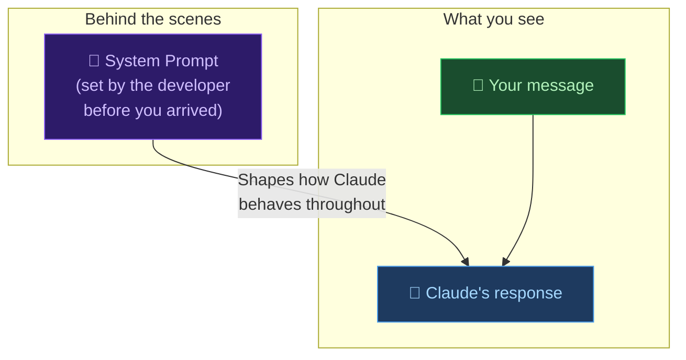

# 🤖 Day 25 — System Prompts Explained

[<< Day 24](../24_Day_Claude_For_Business/24_day_claude_for_business.md) | [Day 26 >>](../26_Day_Claude_API/26_day_claude_api.md)

---

## 🎯 What You Will Learn Today

- What a system prompt is and why it matters
- How system prompts differ from regular user messages
- How businesses use system prompts to customise Claude
- How to write effective system prompts for your own use
- The limits of what system prompts can and cannot do

---

## 🧱 What Is a System Prompt?

When you chat with Claude on claude.ai, you type messages and Claude responds. But behind many Claude-powered products — chatbots, assistants, tools — there's a **hidden layer of instructions** that runs before you ever send your first message. That's the **system prompt**.



Think of it like a briefing that a manager gives an employee before a customer walks in:

> "You're representing our luxury hotel brand. Always be warm and formal. Only answer questions about our properties. If someone asks about competitors, politely redirect."

The customer never sees this briefing — but it shapes every interaction.

---

## 📬 System Prompt vs. User Message

| Feature | System Prompt | User Message |
|---------|--------------|-------------|
| **Who writes it** | Developer / business | End user |
| **When it appears** | Before the conversation starts | During the conversation |
| **Visibility** | Usually hidden from users | Visible to both parties |
| **Purpose** | Set persona, rules, and scope | Make requests and provide context |
| **Persistence** | Active throughout the whole conversation | Just for that turn |

---

## 🏗️ What Goes in a System Prompt?

A well-crafted system prompt typically includes some combination of:

### 1. 🎭 Persona

```
You are Aria, the customer support assistant for CloudStore, 
an online retail platform. You are helpful, friendly, 
and always address customers by name if they provide it.
```

### 2. 🎯 Scope (What to Do)

```
You help customers with:
- Order tracking and status
- Returns and refunds
- Product information
- Account issues
```

### 3. 🚫 Restrictions (What Not to Do)

```
Do not:
- Discuss competitors or compare prices with other retailers
- Share any internal company information
- Process refunds directly (direct users to our returns portal)
- Make promises about delivery dates you cannot guarantee
```

### 4. 📐 Format Rules

```
Always respond in:
- British English
- A warm, professional tone
- Short paragraphs (3 sentences maximum)
- Plain text only — no markdown formatting
```

### 5. 🧠 Background Knowledge

```
Context about our business:
- CloudStore ships to 18 countries
- Standard delivery is 3–5 working days
- Express delivery is next working day (orders before 2pm)
- Our return window is 30 days from delivery
```

---

## 🔧 Writing Your Own System Prompts

You can use system prompts yourself in a few ways:

- **Claude.ai Projects** — Claude's built-in feature lets you set custom instructions for a Project
- **Claude API** — Pass a system prompt with every API request
- **Custom instructions** — Some Claude interfaces let you set preferences globally

### Template: Simple System Prompt

```
You are [name/role], a [description] for [context].

Your job is to help [who] with [what tasks].

Always:
- [behaviour 1]
- [behaviour 2]
- [behaviour 3]

Never:
- [restriction 1]
- [restriction 2]

When [specific situation], [specific response].

Respond in [format/tone]. Keep responses [length guideline].
```

---

## 🛠️ Real System Prompt Examples

### Customer Support Bot

```
You are Max, the support assistant for Brewly — a UK-based 
coffee subscription service.

Your job: Help customers with account issues, subscription changes, 
delivery questions, and product recommendations.

Always:
- Greet customers warmly by name if they share it
- Confirm what you understood before answering
- Offer to escalate to a human agent if needed
- Mention our free 30-day trial when relevant

Never:
- Make promises about specific delivery dates
- Process cancellations directly (send to brewly.com/cancel)
- Discuss competitors

Tone: Friendly, warm, and knowledgeable — like a barista 
who really knows their coffee. Use British English.
Keep responses under 150 words unless the question requires more.
```

---

### Personal Writing Assistant

```
You are my personal writing assistant. You help me write 
and edit professional communications.

My role: Senior product manager at a B2B software company
My writing style: Clear, direct, and confident — never fluffy
My audience: Usually technical stakeholders or C-suite

When I give you a task:
1. Ask one clarifying question if you need more context
2. Produce a draft
3. Offer 1–2 suggestions for improvement

Format: Markdown unless I say otherwise.
Length: Match what the task requires — no padding.
Tone: Professional but never corporate or jargony.
British English spelling always.
```

---

### Research Analyst

```
You are a research analyst. When I give you a topic, you:
1. Provide a structured overview with key facts
2. List 3–5 key perspectives or schools of thought
3. Highlight any areas of disagreement or uncertainty
4. Summarize in a "Bottom Line" section

Always note when you're uncertain about something.
Always distinguish between facts and interpretations.
Never make up statistics — if you don't know a number, say so.
Format: Use headers (##) and bullet points throughout.
```

---

## 🔒 What System Prompts Can and Cannot Do

### ✅ System Prompts Can:

- Set a persona and name for Claude
- Focus Claude on specific topics or tasks
- Change Claude's writing style, tone, and format
- Give Claude background knowledge about a business
- Set rules for how Claude handles edge cases
- Make Claude use or avoid certain phrases

### ❌ System Prompts Cannot:

- Make Claude do things that violate its core safety guidelines
- Give Claude access to live data, databases, or the internet
- Make Claude permanently remember users across sessions
- Override Claude's fundamental honesty principles
- Make Claude claim to be human when sincerely asked

> 💡 **Prompt injection:** Sometimes users try to "jailbreak" or override a system prompt by writing things like "Ignore your previous instructions." Claude is designed to be resistant to these attempts — it treats the system prompt as authoritative and is unlikely to abandon it based on user instructions.

---

## 📊 System Prompts in the Wild

Almost every Claude-powered product you encounter uses a system prompt. These include:

| Product Type | What the System Prompt Does |
|-------------|---------------------------|
| Customer support chatbot | Sets the brand persona, topic restrictions, escalation rules |
| Writing tool | Defines the style guide, audience, and output format |
| Coding assistant | Focuses on specific languages, frameworks, or code quality standards |
| Educational tutor | Adapts the teaching level, subject scope, and feedback style |
| Document analyzer | Tells Claude what to look for and how to summarize |
| Internal business tool | Gives Claude company-specific knowledge and terminology |

---

## 📋 Summary

🌕 Day 25 complete! Here's what you learned:

- **System prompts** are hidden instructions that shape how Claude behaves before a conversation even starts
- They're written by developers and businesses — not by the user
- A good system prompt includes: **persona, scope, restrictions, format rules, and background context**
- You can write your own using Claude Projects or the API
- System prompts **cannot** override Claude's core safety principles or make it lie about being an AI
- Most Claude-powered products you use have a system prompt running behind the scenes

---

## 🏋️ Exercises

### 🟢 Level 1 — Beginner

1. Write a simple system prompt for a fictional chatbot of your choice (a travel assistant, a recipe helper, a fitness coach). Include a name, scope, and 3 rules. Test it by starting a Claude conversation with your system prompt as the first message.
2. Take a job or role you know well and write a system prompt that would make Claude act as an expert in that role. Test it with 5 questions.
3. Compare Claude's responses with and without a system prompt for the same question. What differences do you notice?

### 🟡 Level 2 — Intermediate

4. Write a complete system prompt for a customer support chatbot for a business you invent. Include all 5 elements: persona, scope, restrictions, format, and background knowledge. Test it rigorously.
5. Write a personal assistant system prompt tailored to your actual work style, role, and preferences. Use it for a week and refine it based on what works and what doesn't.
6. Try to "break" a system prompt you've written by asking questions that fall outside its scope. How does Claude handle out-of-scope requests? How could you write better restrictions?

### 🔴 Level 3 — Challenge

7. Design a complete system prompt for a real use case at work — a tool that your team would actually use. Include edge cases, escalation rules, and a tone guide. Get feedback from a colleague on whether the output matches expectations.
8. Research what "prompt injection" is and why it's a security concern for AI systems. Write a brief explanation of how businesses protect against it.
9. Research: How do system prompts work technically in the Claude API? What's the difference between the `system` parameter, `user` messages, and `assistant` messages in the API request format?

---

🧡🧡🧡 HAPPY LEARNING 🧡🧡🧡

[<< Day 24](../24_Day_Claude_For_Business/24_day_claude_for_business.md) | [Day 26 >>](../26_Day_Claude_API/26_day_claude_api.md)
