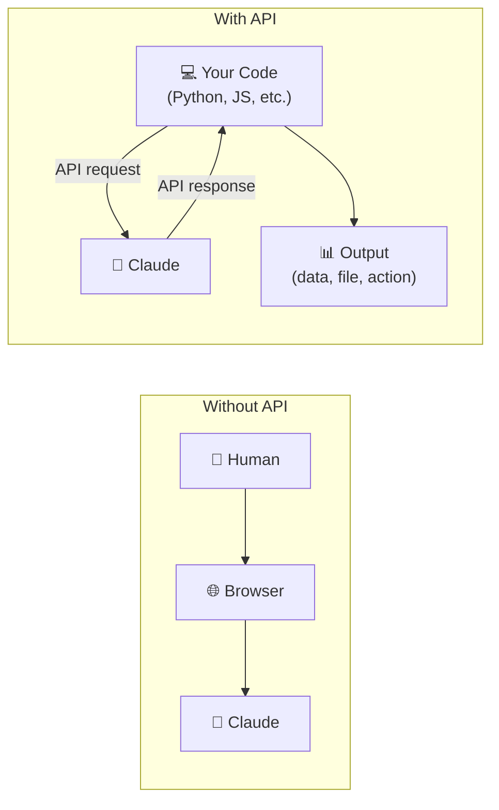
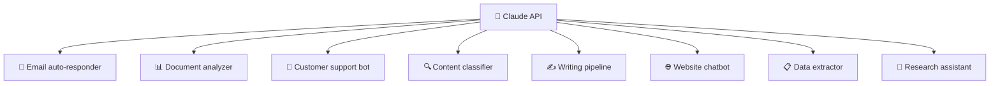

# 🤖 Day 26 — Introduction to the Claude API

[<< Day 25](../25_Day_System_Prompts/25_day_system_prompts.md) | [Day 27 >>](../27_Day_Workflows/27_day_workflows.md)

---

## 🎯 What You Will Learn Today

- What an API is and why it matters for Claude
- How to get access to the Claude API
- The structure of a basic API request
- What you can build with the Claude API
- Key concepts: tokens, models, temperature, and cost

---

## 🔌 What Is an API?

An **API** (Application Programming Interface) is a way for software to talk to other software. When you use claude.ai in a browser, a human is in the loop. But with the Claude API, **your code** sends messages to Claude and receives responses automatically — no human needed.



This unlocks Claude as an engine inside your own applications, scripts, and automated workflows.

---

## 🗝️ Getting API Access

To use the Claude API, you need an **API key** from Anthropic:

1. **Create an account** at [console.anthropic.com](https://console.anthropic.com)
2. **Add billing** — the API is pay-per-use (no free tier, but costs are low for experiments)
3. **Create an API key** in the dashboard
4. **Store it securely** — never paste it into public code or share it

> ⚠️ **Keep your API key secret.** Treat it like a password. If someone else gets it, they can use Claude on your account and you'll pay the bill.

---

## 📦 Your First API Request

Here's the simplest possible API request to Claude, written in Python:

```python
import anthropic

client = anthropic.Anthropic(api_key="your-api-key-here")

message = client.messages.create(
    model="claude-opus-4-5",
    max_tokens=1024,
    messages=[
        {"role": "user", "content": "What is the capital of France?"}
    ]
)

print(message.content[0].text)
```

**Output:**
```
The capital of France is Paris.
```

That's it. Your code sent a message to Claude and received a response — just like typing in a chat window, but fully automated.

---

## 🏗️ Anatomy of an API Request

```python
client.messages.create(
    model="claude-opus-4-5",       # Which Claude model to use
    max_tokens=1024,                # Maximum length of the response
    system="You are a helpful...", # Optional system prompt
    messages=[                     # The conversation
        {"role": "user", "content": "Your question here"}
    ]
)
```

| Parameter | What It Does |
|-----------|-------------|
| `model` | Which Claude model to use (Haiku, Sonnet, Opus) |
| `max_tokens` | Maximum tokens in the response (roughly words × 1.3) |
| `system` | The system prompt — sets behaviour for the whole conversation |
| `messages` | Array of conversation turns (user/assistant alternating) |
| `temperature` | Creativity level: 0 = very consistent, 1 = more varied |

---

## 💬 Adding a System Prompt

```python
message = client.messages.create(
    model="claude-opus-4-5",
    max_tokens=1024,
    system="You are a JSON-only data extraction assistant. 
            Return ONLY valid JSON. No explanations.",
    messages=[
        {"role": "user", "content": "Extract: name, price, and category from: 
         'The Sony WH-1000XM5 headphones cost £299 and are in the electronics category.'"}
    ]
)
```

**Output:**
```json
{
  "name": "Sony WH-1000XM5",
  "price": 299,
  "category": "electronics"
}
```

---

## 🔄 Multi-Turn Conversations via API

To simulate a conversation, you pass the full history in the `messages` array:

```python
messages = [
    {"role": "user", "content": "I'm planning a Python project."},
    {"role": "assistant", "content": "Great! What kind of project are you building?"},
    {"role": "user", "content": "A web scraper for news articles."}
]

response = client.messages.create(
    model="claude-opus-4-5",
    max_tokens=1024,
    messages=messages
)
```

You manage the conversation history yourself — the API is **stateless**, meaning Claude doesn't remember between requests unless you send the history.

---

## 🪙 Understanding Tokens and Cost

### What Are Tokens?

Claude doesn't process words — it processes **tokens**. A token is roughly:
- 1 short word = ~1 token
- 1 longer word = ~1–2 tokens
- 1,000 words ≈ 750 tokens

### How Billing Works

You pay for:
- **Input tokens** — everything you send (messages + system prompt + conversation history)
- **Output tokens** — everything Claude sends back

```
Example:
System prompt:    500 tokens
Your message:     50 tokens
Claude's response: 300 tokens
---------------------------------
Total:            850 tokens billed
```

### Model Pricing (approximate — check console.anthropic.com for current rates)

| Model | Speed | Cost | Best For |
|-------|-------|------|---------|
| Claude Haiku 4.5 | Fastest | Lowest | High-volume tasks, simple extractions |
| Claude Sonnet 4.6 | Balanced | Mid | Most use cases, quality + cost balance |
| Claude Opus 4.5 | Thoughtful | Higher | Complex reasoning, highest quality |

> 💡 **Start with Haiku for experiments.** It's extremely cheap and fast. Move to Sonnet or Opus when you need higher quality.

---

## 🛠️ What You Can Build with the API

Once you have API access, you can build:



### Simple Use Case: Batch Summarizer

```python
import anthropic

client = anthropic.Anthropic(api_key="your-key")

articles = [
    "Article 1 text here...",
    "Article 2 text here...",
    "Article 3 text here..."
]

for i, article in enumerate(articles):
    response = client.messages.create(
        model="claude-haiku-4-5-20251001",
        max_tokens=200,
        messages=[{
            "role": "user",
            "content": f"Summarize this in 2 sentences: {article}"
        }]
    )
    print(f"Article {i+1}: {response.content[0].text}\n")
```

This processes 3 articles automatically — scale it to 300 with the same code.

---

## 🌐 Available SDKs

Anthropic provides official libraries for popular languages:

| Language | Install |
|----------|---------|
| Python | `pip install anthropic` |
| JavaScript / TypeScript | `npm install @anthropic-ai/sdk` |
| Others | Use the REST API directly with any HTTP client |

### JavaScript Example

```javascript
import Anthropic from '@anthropic-ai/sdk';

const client = new Anthropic({ apiKey: 'your-api-key' });

const message = await client.messages.create({
    model: 'claude-opus-4-5',
    max_tokens: 1024,
    messages: [{ role: 'user', content: 'Hello, Claude!' }]
});

console.log(message.content[0].text);
```

---

## ⚠️ Common Beginner Mistakes

| Mistake | Fix |
|---------|-----|
| Hardcoding your API key in code | Use environment variables: `os.environ["ANTHROPIC_API_KEY"]` |
| Setting `max_tokens` too low | Response gets cut off — increase it or check the token count |
| Not handling API errors | Add try/except — APIs can fail, time out, or hit rate limits |
| Using Opus for everything | Use Haiku for simple tasks — much cheaper and faster |
| Forgetting the API is stateless | You must pass conversation history yourself for multi-turn chats |

---

## 📋 Summary

🌕 Day 26 complete! Here's what you learned:

- The **API** lets your code talk to Claude automatically — no browser required
- You need an **API key** from console.anthropic.com (pay-per-use pricing)
- A request requires: `model`, `max_tokens`, and `messages`
- Claude is **stateless** — you manage conversation history yourself
- **Tokens** are the billing unit — roughly 750 tokens per 1,000 words
- **Choose your model wisely:** Haiku for speed/cost, Sonnet for balance, Opus for quality
- The API unlocks building bots, pipelines, tools, and automations

---

## 🏋️ Exercises

### 🟢 Level 1 — Beginner

1. Create an account at console.anthropic.com and explore the API playground (no coding required — it has a built-in interface). Try sending a message with a custom system prompt.
2. Read the Anthropic API pricing page. Calculate roughly what it would cost to summarize 1,000 news articles (average 500 words each) using Claude Haiku.
3. Look at the API documentation for the `messages.create` endpoint. List all the parameters available and what each one does.

### 🟡 Level 2 — Intermediate

4. Write your first API script (Python or JavaScript). Make it send a message to Claude and print the response. Add a custom system prompt that gives Claude a specific persona.
5. Extend your script to handle a batch task: read a list of 5 short texts (you define them), summarize each one, and save the summaries to a file.
6. Add error handling to your script: catch rate limit errors, handle cases where the response is empty, and add a retry mechanism.

### 🔴 Level 3 — Challenge

7. Build a simple command-line chatbot using the API that maintains conversation history across multiple turns. The user types, Claude responds, and the history grows until the user types "exit".
8. Build a batch document classifier: given a list of 10 sentences, classify each as "positive", "negative", or "neutral" using Claude. Output the results as a CSV file.
9. Research: What is "streaming" in the Claude API? How does it differ from a standard request? When would you use it, and what does the code look like?

---

🧡🧡🧡 HAPPY LEARNING 🧡🧡🧡

[<< Day 25](../25_Day_System_Prompts/25_day_system_prompts.md) | [Day 27 >>](../27_Day_Workflows/27_day_workflows.md)
