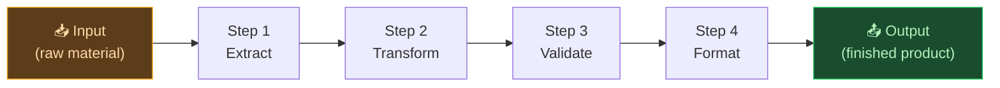
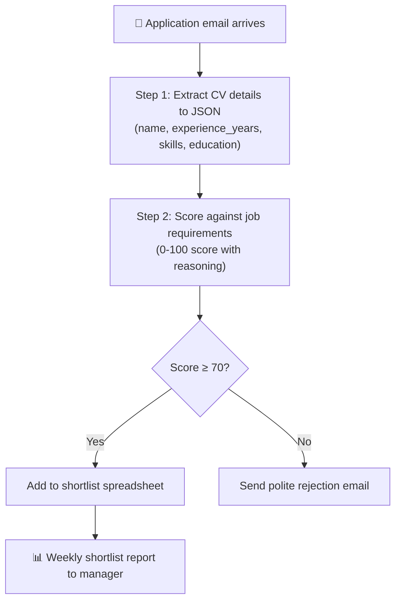

# 🤖 Day 27 — Building Simple Workflows with Claude

[<< Day 26](../26_Day_Claude_API/26_day_claude_api.md) | [Day 28 >>](../28_Day_Claude_With_Tools/28_day_claude_with_tools.md)

---

## 🎯 What You Will Learn Today

- What a Claude workflow is and why workflows beat one-off prompts
- How to design multi-step AI workflows
- Common workflow patterns you can reuse
- How to chain Claude calls together
- How to build workflows without writing code

---

## 🔄 What Is a Workflow?

A **workflow** is a repeatable sequence of steps that takes an input, processes it through one or more Claude calls, and produces a reliable output.

**One-off prompt:** Ask Claude one question, get one answer.

**Workflow:** A structured pipeline where Claude's output in step 1 becomes the input for step 2, and so on.



Workflows are powerful because:
- They're **repeatable** — run the same logic on 1 item or 10,000
- They're **reliable** — each step has a clear, narrow job
- They're **improvable** — you can tune each step independently

---

## 🏗️ The Building Blocks of a Workflow

Every workflow is composed of these elements:

| Element | Description | Example |
|---------|-------------|---------|
| **Input** | The raw material you start with | A customer review, a document, a URL |
| **Step** | A single Claude call with a specific task | Classify, summarize, extract, translate |
| **Output** | What one step produces, used as the next step's input | A JSON object, a list, a score |
| **Condition** | A branching decision based on output | If sentiment = negative → escalate |
| **Final output** | The end result of the whole pipeline | A report, a database entry, an email |

---

## 🧩 Common Workflow Patterns

### Pattern 1: Extract → Transform → Format

```
Input: Raw unstructured text (e.g., a customer review)

Step 1 — Extract:
"Extract: reviewer name, product mentioned, 
 rating (1-5), and main complaint (one sentence).
 Return as JSON."

Step 2 — Transform:
"Based on this JSON, determine:
 - Priority (high if rating ≤ 2, medium if 3, low if 4-5)
 - Department to route to (returns, billing, technical, general)
 Return updated JSON."

Step 3 — Format:
"Format this JSON into a support ticket template:
 Ticket ID, Priority, Department, Summary, Full Details"

Output: Formatted support ticket ready to enter into a system
```

---

### Pattern 2: Classify → Route → Respond

```
Input: Incoming email

Step 1 — Classify:
"Read this email. Classify it as one of:
 invoice_query | complaint | new_enquiry | spam | other
 Return: { category: '', confidence: '' }"

Step 2 — Route:
IF category == "complaint":  → run complaint_response prompt
IF category == "invoice_query": → run invoice_lookup prompt
IF category == "spam":       → discard

Step 3 — Respond:
Run the appropriate response prompt with the email content

Output: Draft reply in the right tone for the right team
```

---

### Pattern 3: Research → Summarize → Report

```
Input: A topic or list of documents

Step 1 — Research:
"Read this document. Extract all key facts and claims.
 Output: bulleted list of facts"

Step 2 — Summarize:
"Given these facts, write a structured summary covering:
 main findings, supporting evidence, open questions"

Step 3 — Report:
"Format this summary as a professional one-page brief:
 Title, Key Findings (table), Detail, Recommendations"

Output: Polished one-page report from raw documents
```

---

### Pattern 4: Generate → Evaluate → Improve

```
Input: A brief or requirements

Step 1 — Generate:
"Write a first draft of [X] based on these requirements."

Step 2 — Evaluate:
"Review this draft. Score it on:
 - Clarity (1-10)
 - Tone (1-10)
 - Completeness (1-10)
 List specific improvements."

Step 3 — Improve:
"Rewrite the draft incorporating these improvements.
 Return only the final version."

Output: Higher-quality output than a single-step approach
```

---

## 🔗 Chaining Claude Calls in Code

Here's a simple Python example that chains two Claude calls:

```python
import anthropic
import json

client = anthropic.Anthropic(api_key="your-key")

review = """
Ordered the headphones 2 weeks ago. Still haven't arrived. 
Tracking says 'processing'. Called customer service twice, 
no help. Very disappointed. Won't order again. - Sarah
"""

# Step 1: Extract structured data
step1 = client.messages.create(
    model="claude-haiku-4-5-20251001",
    max_tokens=500,
    system="Return only valid JSON. No other text.",
    messages=[{
        "role": "user",
        "content": f"""Extract from this review:
        - customer_name
        - issue_type (delivery/product/service/other)
        - sentiment (positive/negative/neutral)
        - urgency (high/medium/low)
        
        Review: {review}"""
    }]
)

extracted = json.loads(step1.content[0].text)
print("Step 1 result:", extracted)

# Step 2: Generate response based on extracted data
step2 = client.messages.create(
    model="claude-haiku-4-5-20251001",
    max_tokens=300,
    system="You are a customer service agent. Be empathetic and helpful.",
    messages=[{
        "role": "user",
        "content": f"""Write a customer service response to this situation:
        Customer: {extracted['customer_name']}
        Issue: {extracted['issue_type']}
        Urgency: {extracted['urgency']}
        
        Original review: {review}"""
    }]
)

print("\nStep 2 result (draft reply):")
print(step2.content[0].text)
```

---

## 🛠️ No-Code Workflow Tools

You don't need to write Python to build Claude workflows. Several no-code tools let you connect Claude to other services with a visual interface:

| Tool | What It Does | Claude Integration |
|------|-------------|-------------------|
| **Zapier** | Connect 5,000+ apps with triggers and actions | Claude step in any Zap |
| **Make (Integromat)** | Visual workflow builder with complex logic | Claude module available |
| **n8n** | Open-source workflow automation | Claude AI node |
| **Notion AI** | Built into Notion workspace | Native AI features |
| **Microsoft Power Automate** | Enterprise workflow platform | Via custom connector |

### Example: Zapier Workflow (No Code)

```
Trigger: New email arrives in Gmail labelled "support"
↓
Step 1: Send email body to Claude (Zapier AI action)
         Prompt: "Classify this email: billing/technical/general/spam"
↓
Step 2: If "billing" → add to Google Sheet "billing_queue"
         If "technical" → create Jira ticket
         If "spam" → apply Gmail label "spam" and archive
↓
Step 3: Send Claude-drafted reply to customer
```

No code. Built entirely in Zapier's visual editor.

---

## 📐 Designing a Good Workflow

Before building, answer these questions:

### 1. What is the input?
- Where does it come from? (email, form, file, database)
- What format is it in? (text, CSV, JSON)
- How much volume? (1/day vs 1,000/day affects model choice)

### 2. What are the steps?
- Break the task into the **smallest possible steps**
- Each step should have **one clear job**
- Steps should produce **structured output** (JSON is usually best between steps)

### 3. What are the failure modes?
- What if Claude misclassifies something?
- What if the input is empty or malformed?
- Do you need a human review step?

### 4. What is the output?
- Where does it go? (email sent, database written, file saved)
- Who consumes it? (human or another system)
- What format does it need to be in?

---

## 🧪 Workflow Design Example

**Problem:** You receive 50 job applications per week by email. You want to screen them automatically and send a shortlist to the hiring manager.



Each step is narrow, the data flows cleanly, and there's a human in the loop at the end (the hiring manager reviews the shortlist, not just the score).

---

## 📋 Summary

🌕 Day 27 complete! Here's what you learned:

- **Workflows** are repeatable sequences of Claude calls — more reliable than one-off prompts
- **Building blocks:** Input → Steps → Conditions → Output
- **Common patterns:** Extract-Transform-Format, Classify-Route-Respond, Research-Summarize-Report, Generate-Evaluate-Improve
- **Chaining in code:** Pass Claude's output from step 1 as input to step 2
- **No-code tools:** Zapier, Make, n8n let you build Claude workflows visually
- **Design first:** Define input, steps, failure modes, and output before building
- Each step should have **one clear job** and produce **structured output**

---

## 🏋️ Exercises

### 🟢 Level 1 — Beginner

1. Design a 3-step workflow on paper (no coding) for a task you do regularly. Define the input, each step's job, and the final output. Which pattern does it follow?
2. Use Zapier's free tier or Make's free tier to build a simple 2-step workflow that uses Claude: trigger on something (e.g., a new form submission) → send to Claude for processing → save the result somewhere.
3. Manually simulate a 3-step workflow in a Claude conversation: run step 1, copy the output, run step 2 with that output, then step 3. Notice how each step narrows the task.

### 🟡 Level 2 — Intermediate

4. Write a Python script that implements the customer review workflow from this lesson (extract → classify → draft response). Test it with 3 different reviews.
5. Design and build a "content pipeline" workflow: takes a rough bullet list of notes → expands into a draft article → scores the draft → improves weak sections. Test it end to end.
6. Add error handling to a workflow: what happens if Claude returns malformed JSON? Write a validation step that catches bad output and either retries or flags for human review.

### 🔴 Level 3 — Challenge

7. Build a complete end-to-end workflow that processes real data from start to finish (e.g., 10 customer emails → classified, drafted responses, and a summary CSV report). Document every step.
8. Design a workflow with a human-in-the-loop step: Claude processes and classifies, then flags uncertain cases for human review before taking action. Implement the flagging logic.
9. Research: What is "agentic AI"? How does it differ from simple chained workflows? What are the risks of autonomous AI agents that take actions without human review?

---

🧡🧡🧡 HAPPY LEARNING 🧡🧡🧡

[<< Day 26](../26_Day_Claude_API/26_day_claude_api.md) | [Day 28 >>](../28_Day_Claude_With_Tools/28_day_claude_with_tools.md)
