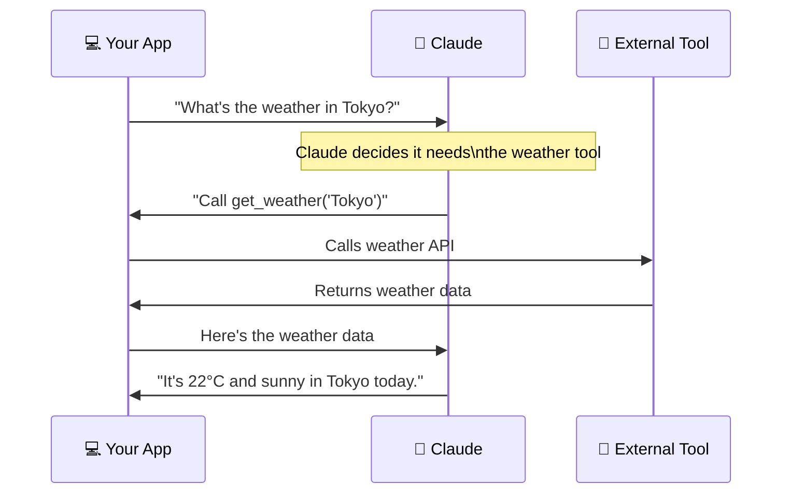
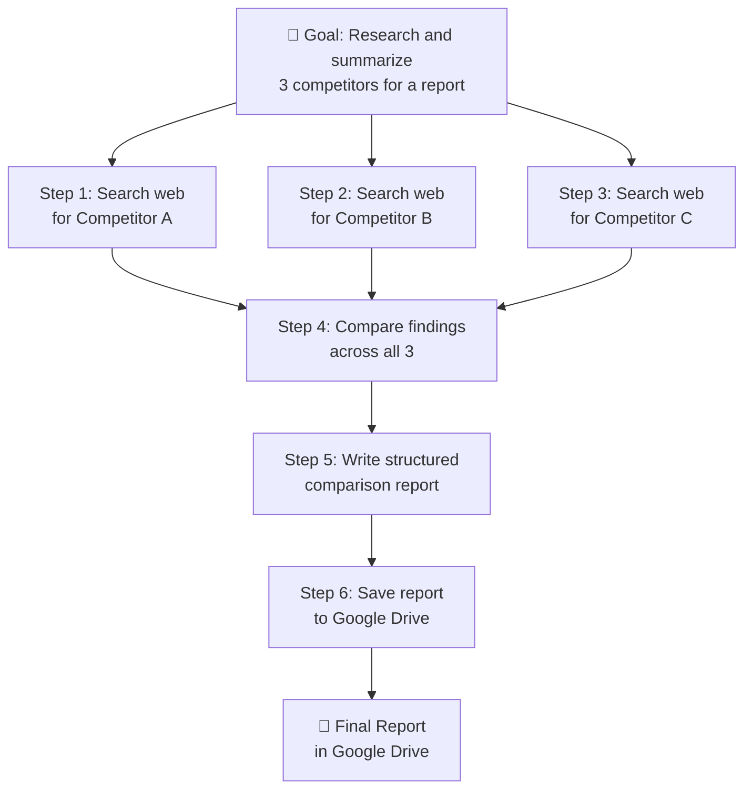

# 🤖 Day 28 — Combining Claude with Other Tools

[<< Day 27](../27_Day_Workflows/27_day_workflows.md) | [Day 29 >>](../29_Day_Mini_Projects/29_day_mini_projects.md)

---

## 🎯 What You Will Learn Today

- Why Claude alone isn't enough for many real-world tasks
- How Claude connects with external tools, data, and services
- Common integration patterns (search, databases, code execution, APIs)
- How tool use (function calling) works
- What "AI agents" are and why they matter

---

## 🌐 Why Claude Needs Other Tools

Claude is incredibly capable — but it has real limits:

| ❌ Claude Cannot | ✅ But With Tools It Can |
|-----------------|------------------------|
| Access the internet | Search the web via a search API |
| Read live data | Connect to databases and data feeds |
| Run code | Trigger a code execution environment |
| Send emails | Call an email API |
| Read your files | Accept file uploads or connect to cloud storage |
| Check current prices | Query a pricing API |
| Book appointments | Use a calendar API |

The pattern is always the same: **Claude handles the intelligence; tools handle the execution**.

---

## 📹 Phase 4 Video Recap

> 🎬 **Video walkthrough coming soon.** A recap of Phase 4 Advanced Claude (Days 22–28) — structured output, multi-turn conversations, business workflows, system prompts, the API, and tool use — will be linked here.
>
> Subscribe to be notified when it's available.

---

## 🔧 How Tool Use Works

Anthropic built **tool use** (also called function calling) directly into the Claude API. Here's how it works:



Claude doesn't call the tool itself — it tells your app **which tool to call and with what parameters**. Your app makes the actual call and feeds the result back to Claude. Claude then uses that result to write its final response.

---

## 🛠️ Defining a Tool for Claude

Here's how you define a tool in the API:

```python
tools = [
    {
        "name": "get_weather",
        "description": "Get current weather for a city",
        "input_schema": {
            "type": "object",
            "properties": {
                "city": {
                    "type": "string",
                    "description": "The city name, e.g. 'London'"
                },
                "unit": {
                    "type": "string",
                    "enum": ["celsius", "fahrenheit"],
                    "description": "Temperature unit"
                }
            },
            "required": ["city"]
        }
    }
]

response = client.messages.create(
    model="claude-opus-4-5",
    max_tokens=1024,
    tools=tools,
    messages=[{
        "role": "user",
        "content": "What's the weather like in Tokyo today?"
    }]
)
```

If Claude decides to use the tool, it returns a `tool_use` block instead of text:

```json
{
  "type": "tool_use",
  "name": "get_weather",
  "input": {"city": "Tokyo", "unit": "celsius"}
}
```

Your app then calls the actual weather API, gets the result, and sends it back to Claude to generate the final response.

---

## 🔌 Common Integration Patterns

### 1. 🔍 Web Search Integration

```
User → Claude receives question
Claude → decides it needs fresh information
Claude → calls search_web("latest AI regulation EU 2025")
Search API → returns 5 relevant results with snippets
Claude → reads results, synthesizes answer
Claude → responds with up-to-date, cited information
```

**Use case:** Research assistant, news summarizer, fact-checker

---

### 2. 🗄️ Database Integration

```
User: "How many orders did customer #4521 place this month?"

Claude → calls query_database(
    query="SELECT COUNT(*) FROM orders 
           WHERE customer_id = 4521 
           AND order_date >= '2025-05-01'"
)
Database → returns: { count: 7 }
Claude → "Customer #4521 placed 7 orders this month."
```

**Use case:** Internal analytics chatbot, CRM assistant

---

### 3. 💻 Code Execution Integration

```
User: "Calculate the compound interest on £5,000 at 6% 
       over 10 years and plot a chart."

Claude → writes Python code
Claude → calls execute_code(code)
Python environment → runs code, returns result + chart
Claude → "After 10 years, your investment grows to £8,954.24. 
          Here's the chart: [chart image]"
```

**Use case:** Data analysis tool, financial calculator, math tutor

---

### 4. 📧 Action-Taking Integration

```
User: "Send the weekly report to the sales team."

Claude → calls send_email(
    to="sales@company.com",
    subject="Weekly Sales Report — Week 22",
    body="[generated report content]"
)
Email API → sends email
Claude → "Done! The weekly report has been sent to the sales team."
```

**Use case:** Automated reporting, notification systems

---

## 🤖 What Are AI Agents?

An **AI agent** is a system where Claude can take a sequence of actions autonomously to complete a goal — not just answer one question, but pursue an objective over multiple steps.



The human sets the goal. The agent figures out the steps, calls the tools needed, and delivers the result.

---

## 🛡️ Safety Considerations for Tool Use

When Claude can take real-world actions, the stakes are higher:

| Risk | Mitigation |
|------|-----------|
| **Irreversible actions** (deleting files, sending emails) | Require human confirmation before executing |
| **Scope creep** | Define exactly which tools Claude can access |
| **Data exposure** | Don't give Claude access to sensitive data it doesn't need |
| **Prompt injection** | Malicious content in web pages or documents can try to hijack Claude's tool calls |
| **Runaway costs** | Set maximum API call budgets and monitor usage |

> ⚠️ **The golden rule:** The more powerful the tool, the more important the human review step. Never give an AI agent the ability to take irreversible high-stakes actions without a human checkpoint.

---

## 🌍 Ready-Made Integration Platforms

You don't have to build tool integrations from scratch. These platforms provide pre-built connectors:

| Platform | What It Connects |
|----------|-----------------|
| **Zapier** | 5,000+ apps — Gmail, Slack, Sheets, Notion, Jira, and more |
| **Make (Integromat)** | Visual flows with complex branching logic |
| **n8n** | Self-hosted, open source, very flexible |
| **LangChain** | Python/JS library for building LLM-powered tools |
| **Claude Projects** | Built-in file upload and search within claude.ai |

### Example: Slack → Claude → Google Sheets (Zapier)

```
Trigger: New message in #customer-feedback Slack channel
↓
Claude: Classify as positive/negative/neutral + extract product mentioned
↓
Condition: If negative → post to #urgent-issues channel
↓
Google Sheets: Append row with timestamp, sentiment, product, original message
```

Built in 10 minutes with no code. Runs automatically on every new message.

---

## 🏗️ Building a Simple Tool-Using App

Here's a minimal pattern for any tool-using Claude application:

```python
def run_agent(user_message, tools, tool_executor):
    messages = [{"role": "user", "content": user_message}]
    
    while True:
        response = client.messages.create(
            model="claude-opus-4-5",
            max_tokens=1024,
            tools=tools,
            messages=messages
        )
        
        # If Claude is done, return the text response
        if response.stop_reason == "end_turn":
            return response.content[0].text
        
        # If Claude wants to use a tool
        if response.stop_reason == "tool_use":
            tool_call = next(b for b in response.content 
                           if b.type == "tool_use")
            
            # Execute the tool
            tool_result = tool_executor(
                tool_call.name, 
                tool_call.input
            )
            
            # Add Claude's response and tool result to history
            messages.append({"role": "assistant", "content": response.content})
            messages.append({
                "role": "user",
                "content": [{
                    "type": "tool_result",
                    "tool_use_id": tool_call.id,
                    "content": str(tool_result)
                }]
            })
            # Loop again — Claude will process the result
```

This loop pattern is the foundation of most Claude-powered agents.

---

## 📋 Summary

🌕 Day 28 complete! Here's what you learned:

- **Claude + tools** = Claude handles intelligence, tools handle execution
- **Tool use / function calling:** Claude signals which tool to call; your app executes it and returns the result
- **Common patterns:** Search, database query, code execution, email/action
- **AI agents:** Claude can pursue multi-step goals autonomously using a loop of tool calls
- **Safety is critical:** Human checkpoints before irreversible actions, minimal tool access, cost limits
- **No-code options:** Zapier, Make, and n8n let you connect Claude to hundreds of services visually
- The **agentic loop** is the core pattern: call Claude → if tool needed, execute and loop → stop when done

---

## 🏋️ Exercises

### 🟢 Level 1 — Beginner

1. Using Zapier or Make's free tier, build a simple 3-step flow: a trigger (new email, form, or scheduled time) → Claude processes it → result goes somewhere (spreadsheet, Slack, email). No coding required.
2. Explore the Anthropic API documentation's tool use section. Read through the example and understand the sequence: request → tool call → result → final response.
3. Think of 5 tasks in your work or life that would benefit from Claude + an external tool. What tool would each one need? What would Claude contribute vs. the tool?

### 🟡 Level 2 — Intermediate

4. Build a simple tool-using script in Python: define one tool (e.g., a `get_date()` function that returns today's date), wire it up to Claude, and ask Claude a question that requires the tool.
5. Extend your tool-using script to handle 2 tools and demonstrate Claude correctly choosing between them based on the user's question.
6. Build a Zapier or Make workflow that processes incoming support emails: classify them, draft a reply with Claude, and log the result to a spreadsheet — all automatically.

### 🔴 Level 3 — Challenge

7. Build a complete agent loop: Claude + at least 2 real tools (a search API and a file-writing function). Give it a research goal and let it autonomously gather information and produce a report.
8. Add a human-in-the-loop checkpoint to your agent: before any "action" tool is called (writing, sending, deleting), print the proposed action and wait for user confirmation.
9. Research: What is MCP (Model Context Protocol) from Anthropic? How does it standardize tool definitions for Claude? What existing MCP servers are available? How does this change how tools are built?

---

🧡🧡🧡 HAPPY LEARNING 🧡🧡🧡

[<< Day 27](../27_Day_Workflows/27_day_workflows.md) | [Day 29 >>](../29_Day_Mini_Projects/29_day_mini_projects.md)
