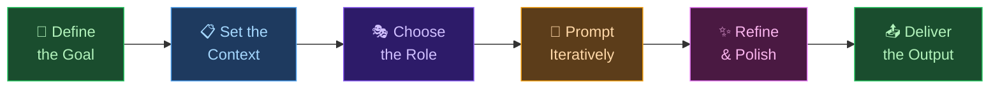

# 🤖 Day 29 — Mini Projects

[<< Day 28](../28_Day_Claude_With_Tools/28_day_claude_with_tools.md) | [Day 30 >>](../30_Day_Final_Project/30_day_final_project.md)

---

## 🎯 What You Will Do Today

- Apply skills from across the entire course in real, end-to-end projects
- Build 5 practical mini projects using only claude.ai
- Learn a repeatable project workflow you can use forever
- Complete at least one project from start to finish

---

## 🏗️ From Learner to Builder

You have spent 28 days learning how Claude works, how to prompt it effectively, and how to apply it across dozens of real-world situations. Today is different — today you **build**.

Mini projects are short, focused tasks that combine multiple skills into something useful and real. Each project below is designed to be completed entirely inside claude.ai, no coding required, in under an hour.

Think of this as your practice ground before the Final Project tomorrow.

---

## 🔄 The Mini Project Workflow

Every successful Claude project follows the same pattern. Internalize this and you can tackle anything:



| Step | What You Do | Day It Came From |
|------|-------------|-----------------|
| Define the goal | Be specific about what you want to produce | Day 9 |
| Set the context | Give Claude the background it needs | Day 10 |
| Choose the role | Tell Claude who to be | Day 11 |
| Prompt iteratively | Build the output in rounds, not one shot | Day 12 |
| Refine & polish | Ask Claude to improve, tighten, format | Days 15, 22 |
| Deliver | Copy, save, or share the final output | Day 27 |

> 💡 **Key mindset shift:** Don't try to get everything in one prompt. Great projects are conversations, not commands.

---

## 📚 Project 1 — Personal Learning Guide

**Turn any topic into a structured study guide you can start using today.**

**Skills used:** Context & Instructions (Day 10), Chain of Thought (Day 12), Research (Day 16), Structured Output (Day 22)

---

**Prompt 1 — Assess the landscape:**

```
You are an expert educator and curriculum designer. I want to learn [TOPIC] from scratch.
My current level: [COMPLETE BEGINNER / SOME FAMILIARITY / INTERMEDIATE]
Time available: [X hours per week]

Think step by step. List the 5 most important concepts I need to learn in [TOPIC],
ordered from foundational to advanced. For each concept, explain in one sentence
why it matters and what understanding it unlocks.
```

**Prompt 2 — Build the study guide:**

```
Now create a structured study guide for these 5 concepts. For each one include:
- A simple 2-sentence explanation (no jargon)
- One real-world analogy that makes it intuitive
- One hands-on exercise I can do this week
- One type of resource to look for (book, video, article, course)

Format everything as a table: Concept | Explanation | Analogy | Exercise | Resource Type
```

**Prompt 3 — Add a learning plan:**

```
Now write a 4-week learning plan based on [X hours per week].
Give each week a single theme and list 3 specific actions for that week.
Be realistic — prioritise depth over breadth.
Present it as a table: Week | Theme | Action 1 | Action 2 | Action 3
```

> 💡 Replace `[TOPIC]`, `[CURRENT LEVEL]`, and `[TIME]` with your real details. The more specific you are, the better the guide.

---

## 📅 Project 2 — Weekly Content Calendar

**Build a 7-day social media content plan for any account or brand.**

**Skills used:** Role Prompting (Day 11), Writing Assistant (Day 15), Structured Output (Day 22)

---

**Prompt 1 — Identify your content strategy:**

```
You are a professional social media strategist with 10 years of experience
growing audiences on [PLATFORM: Instagram / LinkedIn / X / TikTok / YouTube].

I run [DESCRIBE YOUR ACCOUNT OR BUSINESS].
My target audience: [DESCRIBE WHO FOLLOWS YOU OR WHO YOU WANT TO REACH]
My goal: [GROW FOLLOWERS / BUILD AUTHORITY / DRIVE SALES / EDUCATE]

Suggest 5 content themes that would resonate strongly with this audience.
For each theme, explain in one sentence why it works for my specific goal.
```

**Prompt 2 — Create the calendar:**

```
Using those 5 themes, create a 7-day content calendar.
For each day include:
- Day number and theme
- Post idea (one sentence describing the content)
- Hook (the first line to grab attention — make it strong)
- Call to action (what you want the audience to do)

Present it as a table: Day | Theme | Post Idea | Hook | CTA
```

**Prompt 3 — Write the best post:**

```
Pick the strongest post idea from the calendar — the one most likely to perform well.
Write the full post text, ready to copy and paste. Keep it under [WORD LIMIT].
Include 3–5 relevant hashtag suggestions at the end.
```

---

## 💼 Project 3 — Job Application Pack

**Build a tailored cover letter, application analysis, and interview prep for a specific job.**

**Skills used:** Context & Instructions (Day 10), Role Prompting (Day 11), Few-Shot (Day 13), Writing (Day 15)

---

**Prompt 1 — Analyse the fit:**

```
I'm applying for the following job.

JOB TITLE: [TITLE]
COMPANY: [COMPANY NAME]
JOB DESCRIPTION:
[PASTE THE FULL JOB DESCRIPTION]

MY BACKGROUND:
[PASTE YOUR RESUME OR WRITE A 3–5 SENTENCE SUMMARY OF YOUR EXPERIENCE]

Analyse the job description. List the top 5 skills or qualities they are looking for.
Then tell me which of these I clearly demonstrate, which I partially have,
and which I'm missing or need to address in my application.
```

**Prompt 2 — Write the cover letter:**

```
Write a professional cover letter for this role. Use my top 3 matching skills
and make it feel personal, not generic. Structure it in 3 paragraphs:
1. Why I'm genuinely excited about this specific role and company
2. My most relevant experience — use 2 concrete examples from my background
3. A confident, forward-looking closing with a clear call to action

Tone: professional but warm. No corporate clichés. Under 350 words.
```

**Prompt 3 — Prepare for the interview:**

```
Based on the job description, predict the 5 most likely interview questions for this role.
For each question, write a strong model answer using the STAR method
(Situation, Task, Action, Result) based on my background.
Format: Question → STAR Answer (4–6 sentences each)
```

> 💡 **A tailored application that mirrors the job description's language dramatically outperforms a generic one.** This project alone can change your career.

---

## 💡 Project 4 — Mini Business Plan

**Turn a side project or idea into a structured one-pager.**

**Skills used:** Chain of Thought (Day 12), Research & Analysis (Day 16), Data & Explanation (Day 19), Structured Output (Day 22)

---

**Prompt 1 — Diagnose the opportunity:**

```
I have a business idea:
[DESCRIBE YOUR IDEA IN 2–3 SENTENCES]

Think step by step. For this idea, identify:
1. The core problem it solves — be specific about the pain point
2. Who exactly has this problem — describe the target customer in detail
3. Why existing solutions are insufficient or leave gaps
4. How significant this problem is (rough scale — how many people face it?)
```

**Prompt 2 — Build the business model:**

```
Now help me build a simple business model for this idea. Cover:
- Product/Service: What exactly is being sold or delivered?
- Revenue model: How does it make money?
- Cost structure: What are the main costs to deliver this?
- Competitive advantage: Why would customers choose this over alternatives?
- Top 3 competitors and how this idea is different from each

Present each section as a clearly labelled block.
```

**Prompt 3 — Write the executive summary:**

```
Write a 3-sentence executive summary of this business I could use
to explain it to an investor, a potential partner, or a curious friend.

It must answer: What is it? Who is it for? Why will it win?
No buzzwords. No jargon. Clear and specific.
```

---

## 🃏 Project 5 — Custom Flashcard Deck

**Turn any subject into 20 ready-to-study flashcards.**

**Skills used:** Few-Shot Prompting (Day 13), Education & Learning (Day 20), Structured Output (Day 22)

---

**Prompt 1 — Generate the deck:**

```
You are an expert teacher creating study flashcards. Here are two examples
of the exact format I want:

Q: What is a Large Language Model (LLM)?
A: A type of AI trained on vast amounts of text that can understand and
   generate human language in conversation.

Q: What is a "prompt" in the context of AI?
A: The instruction, question, or input you give to an AI model to get a response.

Now create 20 flashcards on the topic of [YOUR TOPIC].
Cover a mix of: key definitions, core concepts, "how it works" questions,
and one common misconception to correct.
Use the exact same Q / A format. Number each card.
```

**Prompt 2 — Add memory hooks to the hardest cards:**

```
Cards [X], [Y], and [Z] cover the most complex concepts.
For each of those cards, add a line beneath the answer:
"💡 Remember it like this:" — write a simple analogy or memory trick
that makes the concept stick for a beginner.
```

> 💡 **Paste the output into Anki, Quizlet, or Notion to start studying immediately.** The consistent format from Prompt 1 makes it easy to import.

---

## 📋 Summary

🌕 Day 29 complete! You just put 28 days of skills to work in real, end-to-end projects.

- The **Mini Project Workflow** (Define → Context → Role → Iterate → Refine → Deliver) works for any task
- **Project 1** — Personal Learning Guide: structured study plan for any topic
- **Project 2** — Content Calendar: 7-day plan + a ready-to-post piece of content
- **Project 3** — Job Application Pack: fit analysis, tailored cover letter, interview prep
- **Project 4** — Mini Business Plan: opportunity diagnosis, business model, executive summary
- **Project 5** — Flashcard Deck: 20 study-ready cards built with few-shot prompting
- The more **specific context** you give Claude, the stronger every output becomes

---

## 🏋️ Exercises

### 🟢 Level 1 — Beginner

1. Pick **any one project** above and run only the first prompt. Write down one thing that surprised you about Claude's response.
2. In your own words, explain the Mini Project Workflow to someone who has never used Claude. Which step do you think most beginners skip — and why?
3. Look back at Day 9 (clear prompts) and Day 10 (context). How do those lessons show up in the project prompts above? Give one specific example.

### 🟡 Level 2 — Intermediate

4. Complete **all three prompts** for one project from start to finish. Save the output somewhere you'll actually use it.
5. Take one project and rerun it for a completely different topic or context. How does the output change? What patterns stay the same regardless of the topic?
6. The Job Application Pack uses four different techniques from the course. Identify which prompt uses which technique, and explain why each was chosen for that step.

### 🔴 Level 3 — Challenge

7. **Combine two projects in one session.** For example: build a Learning Guide (Project 1) for a skill that directly supports your Job Application (Project 3). Document what you created and how the two projects connected.
8. Design your own mini project that isn't listed above. Write the three-prompt sequence following the same structure. Identify which course skills it combines.
9. Take one completed project output and run a critique round: ask Claude to find 3 weaknesses in the output and suggest specific improvements. Apply the improvements. How different is the final version from the first draft?

---

## 📢 Share Your Output

You just finished a complete, real-world project using Claude. That is genuinely impressive. Show someone.

> 🌍 **Post your project output** on LinkedIn, X, or Instagram with **[#30DaysOfClaude](https://github.com/amir-sharfu/30-Days-of-Claude/issues/1)** — a learning guide, a cover letter, a business plan, a content calendar. Whatever you made, it counts.
>
> Drop it in the **[community thread on GitHub](https://github.com/amir-sharfu/30-Days-of-Claude/issues/1)**. You'll see what other learners built, get ideas for Day 30, and add your output to the Hall of Fame.

---

🧡🧡🧡 HAPPY LEARNING 🧡🧡🧡

[<< Day 28](../28_Day_Claude_With_Tools/28_day_claude_with_tools.md) | [Day 30 >>](../30_Day_Final_Project/30_day_final_project.md)
