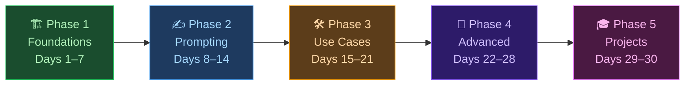
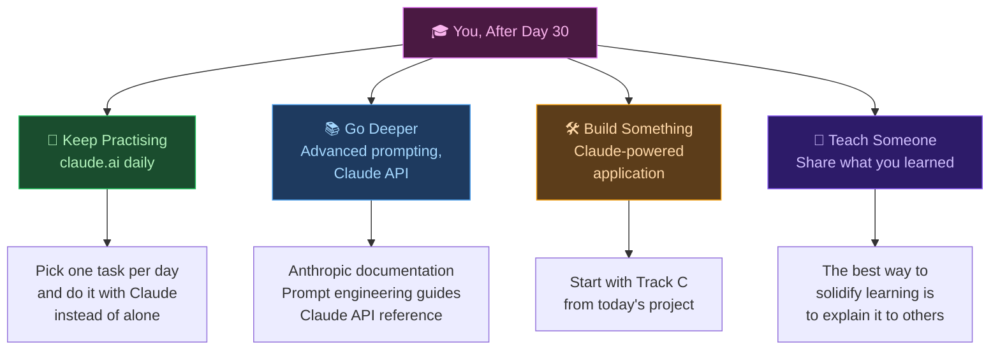

# 🤖 Day 30 — Final Project & Graduation 🎓

[<< Day 29](../29_Day_Mini_Projects/29_day_mini_projects.md)

---

## 🎯 What You Will Do Today

- Complete a self-directed final project that spans the entire course
- Reflect on how far you've come from Day 1 to Day 30
- Review every skill you've built over 30 days
- Discover where to go next from here
- Graduate 🎓

---

## 🏁 You Made It

Thirty days ago, you started this course knowing nothing — or very little — about AI and Claude. You showed up every day, read the lessons, ran the prompts, did the exercises, and built something real.

Today is not the end. Today is the beginning of everything you can now do.

Before you dive into the final project, take one minute to look at how far you've come:



You built all five of those phases — one day at a time.

---

## 🧠 What You've Mastered — The Full Skills Map

Here is every skill you now carry:

| Phase | Day | Skill | What It Lets You Do |
|-------|-----|-------|---------------------|
| 🏗️ Foundations | 1 | Understanding AI & Claude | Know what Claude is and how it thinks |
| | 2 | Setup & Access | Navigate claude.ai confidently |
| | 3 | First Conversations | Start and steer any conversation |
| | 4 | Capabilities | Know what Claude can and can't do |
| | 5 | Models & Plans | Choose the right tier for any task |
| | 6 | Safety & Ethics | Use Claude responsibly |
| ✍️ Prompting | 8 | What is a Prompt? | Understand the anatomy of every request |
| | 9 | Clear & Specific Prompts | Get dramatically better answers |
| | 10 | Context & Instructions | Brief Claude like a colleague |
| | 11 | Role Prompting | Unlock specialist modes |
| | 12 | Chain of Thought | Make Claude reason step by step |
| | 13 | Few-Shot Prompting | Teach Claude by example |
| 🛠️ Use Cases | 15 | Writing Assistant | Draft, edit, and polish any document |
| | 16 | Research & Summarization | Compress information, fast |
| | 17 | Code Understanding | Read, explain, and fix code |
| | 18 | Translation & Language | Work across languages |
| | 19 | Data Analysis | Interpret numbers and findings |
| | 20 | Education & Learning | Turn Claude into a personal tutor |
| | 21 | Creative Writing | Write stories, scripts, and creative content |
| 🚀 Advanced | 22 | Structured Output | Get JSON, tables, and lists on demand |
| | 23 | Multi-Turn Conversations | Manage long, complex sessions |
| | 24 | Claude for Business | Apply Claude to real productivity workflows |
| | 25 | System Prompts | Configure Claude's behaviour from the start |
| | 26 | Claude API | Understand how developers build with Claude |
| | 27 | Workflows | Chain Claude into multi-step processes |
| | 28 | Claude + Tools | Understand agents, function calling, integrations |
| 🎓 Projects | 29 | Mini Projects | Build real deliverables end-to-end |

That is **25 distinct skills** across 5 phases. You have them all.

---

## 🪞 Reflection: Day 1 You vs. Day 30 You

Before starting the final project, spend 10 minutes on this reflection. Open a new Claude chat and run these prompts — or write your answers out yourself.

**Prompt:**

```
I just completed a 30-day course on using Claude AI. Help me reflect on my growth.

On Day 1, I knew: [write what you knew about AI before starting]
On Day 1, my first prompt was probably: [write a sample of how you used to prompt]

Today, I understand: [write what you know now]
Today, I would prompt the same request like this: [rewrite the same task with your new skills]

Analyse the difference between my Day 1 and Day 30 approaches.
What specifically improved, and why does it matter?
```

> 💡 **This exercise is more valuable than it looks.** Seeing the gap between where you started and where you are now makes the learning real — and shows you what to do next.

---

## 🎯 The Final Project

Choose **one track** that matches your situation. Each produces a real, finished piece of work you'll keep and use after today.

---

### 🟢 Track A — The Personal AI Toolkit *(Recommended for most learners)*

**Who it's for:** Anyone who wants a personalised system for using Claude in daily life.

**What you'll build:** A personal Claude playbook — a document that captures your best prompts, workflows, and use cases, tailored to your specific life and work.

---

**Phase 1 — Audit your life:**

```
I've just completed a 30-day course on Claude AI. I want to build a personal
AI playbook for how I use Claude going forward.

My situation: [describe your job, studies, or main daily activities]
My biggest time drains: [list 3 tasks that take too long or feel tedious]
My biggest goals right now: [list 2–3 things you're working toward]

Identify the top 5 areas of my life where Claude could save me the most time
or have the biggest positive impact. For each area, give one specific example
of how Claude could help.
```

**Phase 2 — Build your prompt library:**

```
For each of the 5 areas you identified, write me the ideal "master prompt" —
a reusable prompt template I can use repeatedly, with [PLACEHOLDERS] for
the parts that change each time.

Include a one-sentence description of when to use each prompt.
Format it clearly so I can copy each prompt into a notes app.
```

**Phase 3 — Design your workflow:**

```
Now design a simple weekly workflow that shows me exactly how to use Claude
across a typical week in my life.

Format it as a day-by-day table: Day | Task | Claude Prompt to Use | Expected Output
Include at least one Claude task per day.
Make it realistic and specific to my situation above.
```

**Phase 4 — Write your Claude README:**

```
Write a one-page "Claude README" for myself — a personal reference document
I can look at any time to remember how to get the best from Claude.

Include:
- My top 5 use cases (from Phase 1)
- 3 prompting rules I should always follow
- 3 common mistakes to avoid
- My "go-to" prompt for when I'm stuck or overwhelmed

Write it in first person, as if I'm writing a note to my future self.
```

---

### 🟡 Track B — The Professional AI Playbook *(For people using Claude at work)*

**Who it's for:** Professionals, students, freelancers, and entrepreneurs who want to systematically apply Claude to their work.

**What you'll build:** A professional AI strategy document — a complete playbook for how your team, department, or business should use Claude.

---

**Phase 1 — Map the opportunity:**

```
I work as [JOB TITLE] at [TYPE OF COMPANY/ORGANIZATION].
My main responsibilities: [LIST 3–5 KEY TASKS]
My team's biggest challenges: [LIST 2–3 PAIN POINTS]

You are a senior AI strategy consultant. Map the top 10 tasks in my role
that Claude could assist with. For each task, estimate:
- Time saved per week (rough estimate)
- Quality improvement (better output, fewer errors, faster iteration)
- Risk to watch for (where Claude might get things wrong)

Present as a prioritised table, highest-impact tasks first.
```

**Phase 2 — Build the use case library:**

```
Take the top 5 tasks from the priority table.
For each task, write:
1. A step-by-step workflow: exactly how I would use Claude to complete this task
2. The key prompt(s) needed at each step
3. How to verify the output before using it

Format each use case as a mini SOP (Standard Operating Procedure).
```

**Phase 3 — Address the risks:**

```
For my role as [JOB TITLE], identify the top 3 risks of using Claude at work:
- Accuracy risks (where hallucinations could cause problems)
- Privacy risks (what data should never be sent to Claude)
- Dependency risks (where over-relying on Claude could backfire)

For each risk, write a clear guideline — one or two sentences — that I or
my team should follow. Make it practical, not generic.
```

**Phase 4 — Write the team playbook:**

```
Now write a 1-page "AI Playbook" I could share with my manager or team.
It should cover:
- Why we're using Claude and what problem it solves
- Our top 5 use cases (from Phase 2), summarised in one sentence each
- 3 rules for responsible use (from Phase 3)
- How to get started (3 concrete first steps)

Write it professionally — clear, direct, no jargon. As if it would go in
a company wiki or onboarding document.
```

---

### 🔴 Track C — The Developer Launchpad *(For those going deeper into Claude's technical side)*

**Who it's for:** Learners who want to go beyond claude.ai and understand how to build with Claude.

**What you'll build:** A technical architecture document and prototype plan for a Claude-powered application.

---

**Phase 1 — Define the application:**

```
I want to build a Claude-powered application. My idea:
[DESCRIBE YOUR APP IDEA IN 2–3 SENTENCES]

Target users: [WHO WILL USE IT]
Core problem it solves: [THE PAIN POINT]

You are a senior AI engineer. Help me define the minimum viable version
of this application. What is the single most important thing it must do?
What can be left for a later version?
```

**Phase 2 — Design the architecture:**

```
Design the technical architecture for this Claude-powered application.
Include:
- How the user interacts with the system (input/output flow)
- How Claude fits in (what it does, what it doesn't do)
- What external tools or data sources are needed (if any)
- What the system prompt should accomplish
- What tool use / function calling is needed (if any)

Present it as:
1. A plain-language architecture description
2. A mermaid diagram showing the data flow from user → app → Claude → output
```

**Phase 3 — Write the system prompt:**

```
Write the system prompt for this application. It should:
- Define Claude's role and persona clearly
- Set the boundaries of what Claude will and won't do
- Include any formatting instructions for the output
- Handle the most common edge case (a user input that might cause problems)

Then explain each section of the system prompt and why you made those choices.
```

**Phase 4 — Plan the build:**

```
Create a realistic build plan for this application assuming I am a
[BEGINNER / INTERMEDIATE] developer with [X hours per week] to work on this.

Break it into 4 milestones:
- Milestone 1: Proof of concept (just Claude responding correctly)
- Milestone 2: Basic interface (user can interact with it)
- Milestone 3: Polish (error handling, edge cases, good UX)
- Milestone 4: Launch (how to share or deploy it)

For each milestone: what gets built, what you'll learn, estimated time.
```

---

## 🌅 What Comes Next

Graduating from 30 Days of Claude is not an ending — it's a launchpad. Here's where to go from here:



### Keep Practising
The single most powerful thing you can do after today: **use Claude every day for one real task**. Not as an experiment — as a tool. The gap between people who master AI and people who don't is almost entirely usage frequency.

### Go Deeper
- **Anthropic's Prompt Engineering Guide** — free, official, deep
- **Claude API documentation** — for when you're ready to build
- **30 Days of Claude Code** *(coming soon)* — the next course in this series, focused on using Claude as a developer tool

### Build Something
Take Track C or any idea from Day 29 and turn it into something real. Nothing accelerates learning faster than shipping.

### Teach Someone
Explain what you learned to a friend, colleague, or family member. Write a post. Record a short video. Teaching forces you to understand what you actually know — and fills in the gaps.

---

## 📋 Summary

🌕 Day 30 complete — and so is the entire course. Here is what you accomplished:

- **25 skills** across 5 phases, from understanding AI to building with it
- A **Final Project** (Track A, B, or C) — a real deliverable you keep and use
- A clear picture of **what you know now vs. Day 1**
- A map of **where to go next**

But more than all of that: you built the habit of thinking with AI as a tool. That habit — reaching for Claude when you have a hard task, a blank page, or a complex problem — is the real graduation.

---

## 🏋️ Exercises

### 🟢 Level 1 — Beginner

1. Complete **Phase 1 only** of whichever Track you choose. Save the output. Read it tomorrow and see if you agree with what Claude said about your situation.
2. Write a 3-sentence answer to: "What is the most useful thing I learned in 30 Days of Claude?" Post it somewhere — notes app, journal, social media, anywhere.
3. Find one person in your life who would benefit from using Claude and teach them one thing you learned. Which lesson would you start with, and why?

### 🟡 Level 2 — Intermediate

4. Complete all four phases of your chosen track. You now have a finished, real-world deliverable. What will you actually do with it?
5. Go back to Day 1 and reread the very first lesson. What do you understand now that you didn't understand then? What questions do you have now that you didn't know to ask on Day 1?
6. Design a "30 Days of Claude — Month 2" plan for yourself. What 5 skills would you deepen or add in the next 30 days?

### 🔴 Level 3 — Challenge

7. Complete all four phases of **two different tracks** — for example, Track A (personal) and Track B (professional). How do the outputs differ? Which one was harder? Which one was more useful?
8. Run a full "Day 30 audit" of your Claude usage across the course. Looking back at all the exercises you completed, which three produced the most useful real-world output? What made those prompts work so well?
9. Share your final project output publicly — a LinkedIn post, a GitHub README, a tweet, a blog post. Tag it `#30DaysOfClaude`. Teaching and sharing is the final phase of learning.

---

## 🎓 Graduation

You set out 30 days ago to learn Claude AI from scratch.

You showed up every day. You ran the prompts. You did the exercises. You pushed through the days when it felt abstract and trusted the process when it wasn't immediately obvious why it mattered.

And now you know things that most people don't:

- How to communicate with an AI effectively
- How to get outputs that are actually useful
- How to apply it to writing, research, coding, business, creativity, and more
- How to think about AI as a tool rather than a magic trick

That knowledge is yours. No one can take it from you. And it will only get more valuable as AI becomes more central to how the world works.

Go build something. Go teach someone. Go solve a problem you've been putting off.

**The course is over. The learning never stops.**

<div align="center">


</div>

---

🧡🧡🧡 HAPPY LEARNING 🧡🧡🧡

[<< Day 29](../29_Day_Mini_Projects/29_day_mini_projects.md)
