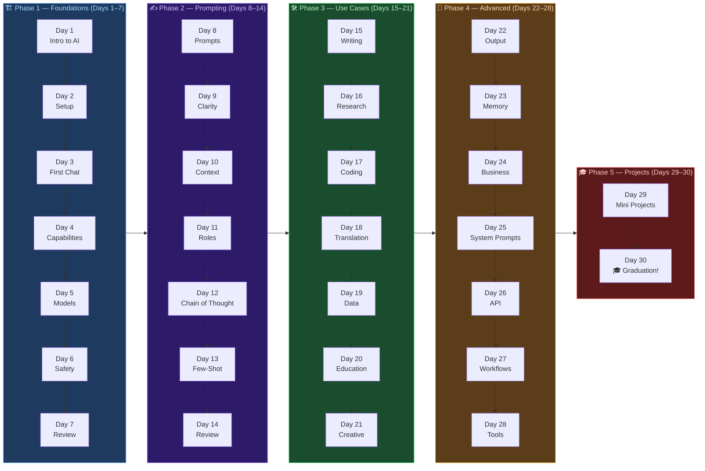

# 🤖 30 Days Of Claude

**A 30-day journey from complete beginner to confident Claude AI user.**

---

## 🌍 About This Course

**30 Days Of Claude** is a step-by-step, beginner-friendly challenge that teaches you how to use **Claude AI** — one of the world's most capable AI assistants — from scratch.

No coding experience required. No prior AI knowledge needed. Just curiosity and 30 minutes a day.

By the end of this challenge, you will:
- Understand what Claude is and how it works
- Write effective prompts that get great results
- Apply Claude to real-world tasks (writing, research, coding, and more)
- Know how to use Claude for your work, study, and creative projects

---

## 📋 Prerequisites

- A computer with internet access
- A free [Claude account](https://claude.ai) (sign up takes 2 minutes)
- 30 minutes per day
- Curiosity and willingness to experiment

---

## 🗺️ How to Use This Course

1. Start at Day 1 and work through the days in order
2. Read each lesson carefully
3. Try all the examples yourself — don't just read them
4. Complete the exercises at the end of each day
5. Share what you learn with others

> 💡 **Tip:** The best way to learn Claude is by using it. Open claude.ai alongside this course and practice every concept as you read.

---

## 📅 Table of Contents

### 🏗️ Phase 1: Foundations (Days 1–7)

| Day | Topic | Link |
|-----|-------|------|
| 01 | Introduction to Claude & AI | [Day 1 >>](./01_Day_Introduction/01_day_introduction.md) |
| 02 | Setting Up — claude.ai, Apps & Access | [Day 2 >>](./02_Day_Setup/02_day_setup.md) |
| 03 | Your First Conversation | [Day 3 >>](./03_Day_First_Conversation/03_day_first_conversation.md) |
| 04 | Understanding Claude's Capabilities | [Day 4 >>](./04_Day_Capabilities/04_day_capabilities.md) |
| 05 | Claude Models & Plans | [Day 5 >>](./05_Day_Models_And_Plans/05_day_models_and_plans.md) |
| 06 | Claude Safety, Ethics & Responsible Use | [Day 6 >>](./06_Day_Safety_And_Ethics/06_day_safety_and_ethics.md) |
| 07 | Week 1 Review & Practice | [Day 7 >>](./07_Day_Week1_Review/07_day_week1_review.md) |

### ✍️ Phase 2: The Art of Prompting (Days 8–14)

| Day | Topic | Link |
|-----|-------|------|
| 08 | What is a Prompt? | [Day 8 >>](./08_Day_What_Is_A_Prompt/08_day_what_is_a_prompt.md) |
| 09 | Writing Clear & Specific Prompts | [Day 9 >>](./09_Day_Clear_Prompts/09_day_clear_prompts.md) |
| 10 | Using Context & Instructions | [Day 10 >>](./10_Day_Context_And_Instructions/10_day_context_and_instructions.md) |
| 11 | Role Prompting | [Day 11 >>](./11_Day_Role_Prompting/11_day_role_prompting.md) |
| 12 | Chain of Thought Prompting | [Day 12 >>](./12_Day_Chain_Of_Thought/12_day_chain_of_thought.md) |
| 13 | Few-Shot Prompting | [Day 13 >>](./13_Day_Few_Shot_Prompting/13_day_few_shot_prompting.md) |
| 14 | Week 2 Review & Practice | [Day 14 >>](./14_Day_Week2_Review/14_day_week2_review.md) |

### 🛠️ Phase 3: Claude in Action — Use Cases (Days 15–21)

| Day | Topic | Link |
|-----|-------|------|
| 15 | Writing Assistant — Drafts, Edits, Emails | [Day 15 >>](./15_Day_Writing_Assistant/15_day_writing_assistant.md) |
| 16 | Research & Summarization | [Day 16 >>](./16_Day_Research_And_Summarization/16_day_research_and_summarization.md) |
| 17 | Code Understanding & Generation | [Day 17 >>](./17_Day_Code_Understanding/17_day_code_understanding.md) |
| 18 | Translation & Language Tasks | [Day 18 >>](./18_Day_Translation_And_Language/18_day_translation_and_language.md) |
| 19 | Data Analysis & Explanation | [Day 19 >>](./19_Day_Data_Analysis/19_day_data_analysis.md) |
| 20 | Education & Learning with Claude | [Day 20 >>](./20_Day_Education_And_Learning/20_day_education_and_learning.md) |
| 21 | Creative Writing & Storytelling | [Day 21 >>](./21_Day_Creative_Writing/21_day_creative_writing.md) |

### 🚀 Phase 4: Advanced Claude (Days 22–28)

| Day | Topic | Link |
|-----|-------|------|
| 22 | Structured Output — JSON, Tables, Lists | [Day 22 >>](./22_Day_Structured_Output/22_day_structured_output.md) |
| 23 | Multi-Turn Conversations & Memory | [Day 23 >>](./23_Day_Multi_Turn_Conversations/23_day_multi_turn_conversations.md) |
| 24 | Claude for Business & Productivity | [Day 24 >>](./24_Day_Claude_For_Business/24_day_claude_for_business.md) |
| 25 | System Prompts Explained | [Day 25 >>](./25_Day_System_Prompts/25_day_system_prompts.md) |
| 26 | Introduction to the Claude API | [Day 26 >>](./26_Day_Claude_API/26_day_claude_api.md) |
| 27 | Building Simple Workflows with Claude | [Day 27 >>](./27_Day_Workflows/27_day_workflows.md) |
| 28 | Combining Claude with Other Tools | [Day 28 >>](./28_Day_Claude_With_Tools/28_day_claude_with_tools.md) |

### 🎓 Phase 5: Projects (Days 29–30)

| Day | Topic | Link |
|-----|-------|------|
| 29 | Mini Projects | [Day 29 >>](./29_Day_Mini_Projects/29_day_mini_projects.md) |
| 30 | Final Project & Graduation | [Day 30 >>](./30_Day_Final_Project/30_day_final_project.md) |

---

## 🧡🧡🧡 HAPPY LEARNING 🧡🧡🧡

---

## 👤 Author

**Your Name**
- GitHub: [@yourusername](https://github.com/yourusername)

---

## 📄 License

This project is licensed under the MIT License — see the [LICENSE](./LICENSE) file for details.

---

⭐ If this course helped you, please give it a star on GitHub! ⭐

